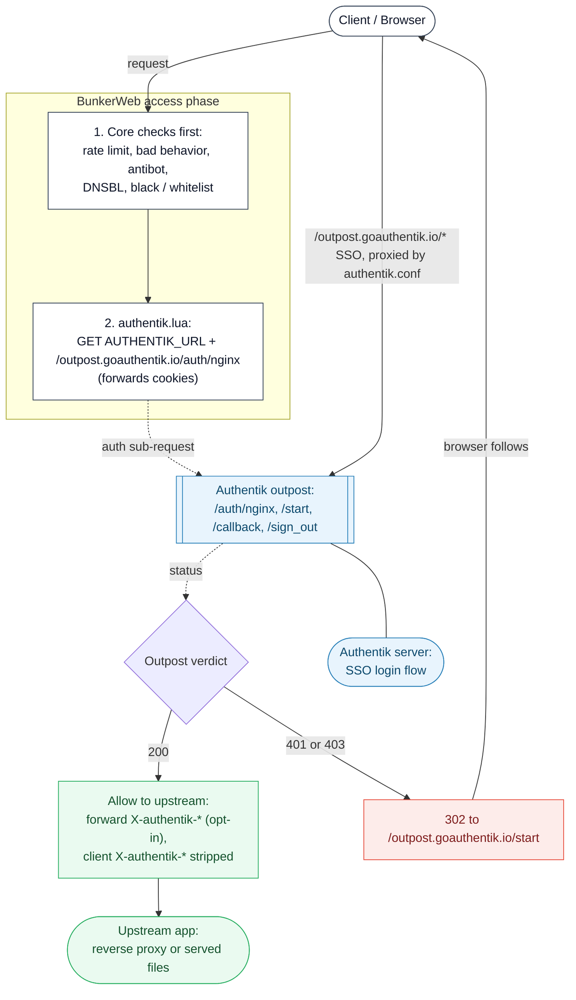

# Authentik plugin



This [plugin](https://www.bunkerweb.io/latest/plugins/?utm_campaign=self&utm_source=github)
adds [Authentik](https://goauthentik.io/) forward authentication to a
BunkerWeb site. It works on top of any existing service configuration -
reverse proxy, served files, custom location blocks - without replacing them.

The auth check runs from Lua during BunkerWeb's access phase, so all of
BunkerWeb's built-in checks (rate limit, bad behavior, antibot, DNSBL,
whitelist / blacklist, ...) run _before_ the Authentik subrequest fires.
Bots and rate-limited clients get denied without ever touching Authentik.

# Table of contents

- [Authentik plugin](#authentik-plugin)
- [Table of contents](#table-of-contents)
- [Request flow](#request-flow)
- [Setup](#setup)
  - [Docker / Swarm](#docker--swarm)
  - [Authentik configuration](#authentik-configuration)
  - [Verifying it works](#verifying-it-works)
- [Settings](#settings)
- [Troubleshooting](#troubleshooting)
- [Notes](#notes)

# Request flow

For a request to `https://app.example.com/something`:

1. BunkerWeb's access-phase checks run (rate limit, bad behavior, antibot,
   DNSBL, blacklist, ...). If any of them deny, the request stops here.
2. `authentik.lua` runs. If the URI is under `AUTHENTIK_OUTPOST_PATH`
   (default `/outpost.goauthentik.io`), it passes through untouched - that's
   the SSO flow itself, served by the outpost.
3. Otherwise the handler does an HTTP `GET` against
   `<AUTHENTIK_URL>/outpost.goauthentik.io/auth/nginx`, forwarding the
   browser's cookies and `X-Original-URL`.
   - **200** - request continues to its normal destination (reverse proxy,
     file serving, custom location). Any `Set-Cookie` from Authentik is
     relayed to the client so the session refreshes correctly.
   - **401 / 403** - `302` to `<outpost_path>/start?rd=<original_url>`, which
     kicks off the SSO login.
4. The server-level snippet (`confs/server-http/authentik.conf`) raises
   `proxy_buffers` / `proxy_buffer_size`, sets `port_in_redirect off`, and
   declares the `location <outpost_path>` block that proxies the SSO
   endpoints (`/auth`, `/start`, `/callback`, `/sign_out`, ...) back to the
   Authentik outpost. Keeping these on the protected site's own domain is
   what lets the proxy provider's session cookie be scoped correctly.

# Setup

See the [plugins section](https://docs.bunkerweb.io/latest/plugins/?utm_campaign=self&utm_source=github)
of the BunkerWeb documentation for the generic plugin installation procedure
(the short version: drop the `authentik/` directory into the scheduler's
`/data/plugins/` and restart).

## Docker / Swarm

`AUTHENTIK_URL` is the URL **BunkerWeb itself** uses to call Authentik -
typically an internal Docker network address. Users still complete the
login on Authentik's own public URL (configured separately in Authentik,
not here). Both BunkerWeb and the user's browser need to be able to reach
that public URL; otherwise login redirects from `/outpost.../start` go
nowhere.

```yaml
services:

  bunkerweb:
    image: bunkerity/bunkerweb:1.6.0
    ...
    networks:
      - bw-services
      - bw-authentik
    ...

  bw-scheduler:
    image: bunkerity/bunkerweb-scheduler:1.6.0
    ...
    environment:
      SERVER_NAME: "app.example.com"
      USE_REVERSE_PROXY: "yes"
      REVERSE_PROXY_HOST: "http://app:3000"
      REVERSE_PROXY_URL: "/"

      USE_AUTHENTIK: "yes"
      # Internal URL - what BunkerWeb uses to call Authentik:
      AUTHENTIK_URL: "http://authentik-server:9000"

  authentik-server:
    # Must also be reachable on a public URL (e.g. https://authentik.example.com)
    # so users can complete the login flow.
    image: ghcr.io/goauthentik/server:latest
    ...
    networks:
      - bw-authentik

networks:
  bw-services:
    name: bw-services
  bw-authentik:
    name: bw-authentik
```

## Authentik configuration

In the Authentik admin UI:

1. Create a **Proxy Provider** for the protected site in **Forward Auth
   (single application)** mode. _External host_ should be the public URL of
   the protected site (e.g. `https://app.example.com`).
2. Create or assign an **Application** that uses the provider.
3. Attach the application to an **Outpost**. The built-in _authentik Embedded
   Outpost_ is the simplest choice - `AUTHENTIK_URL` then points at the
   Authentik server itself (`http://authentik-server:9000` in the example
   above). For a standalone outpost, point `AUTHENTIK_URL` at that outpost's
   address instead.
4. Make sure the Authentik server itself has a public URL (defined in
   _System → Brands_ or via the `AUTHENTIK_HOST` env var). Browsers are
   redirected there to enter credentials.

## Verifying it works

1. Reload the scheduler. The Authentik plugin should appear in BunkerWeb's
   plugins list (web UI or scheduler logs).
2. Visit a protected URL in a private window. You should land on the
   Authentik login page (note the URL - it's served by Authentik, not by
   BunkerWeb).
3. After logging in, you should be redirected back to the protected URL and
   see the upstream service's response.
4. In the Authentik server logs you should see one `/outpost.goauthentik.io/auth/nginx`
   call per protected request. If you see far more (e.g. one per static
   asset), the outpost-path skip isn't matching - double-check
   `AUTHENTIK_OUTPOST_PATH`.

# Settings

| Setting                           | Default                                                                                                               | Context   | Multiple | Description                                                                                                                                                                                                                                                                                                                                                                                              |
| --------------------------------- | --------------------------------------------------------------------------------------------------------------------- | --------- | -------- | -------------------------------------------------------------------------------------------------------------------------------------------------------------------------------------------------------------------------------------------------------------------------------------------------------------------------------------------------------------------------------------------------------- |
| `USE_AUTHENTIK`                   | `no`                                                                                                                  | multisite | no       | Activate Authentik forward authentication for this site.                                                                                                                                                                                                                                                                                                                                                 |
| `AUTHENTIK_URL`                   |                                                                                                                       | multisite | no       | Base URL of the Authentik outpost (e.g. http://authentik:9000 for the embedded outpost or http://outpost:9000 for a standalone one). The plugin calls this base URL followed by /outpost.goauthentik.io/auth/nginx for the auth check and uses the same base for the outpost proxy. Required when USE_AUTHENTIK is yes.                                                                                  |
| `AUTHENTIK_OUTPOST_PATH`          | `/outpost.goauthentik.io`                                                                                             | multisite | no       | Local URL path under which the Authentik outpost endpoints (auth, start, callback, sign_out, ...) are exposed on this site. Must start with /.                                                                                                                                                                                                                                                           |
| `AUTHENTIK_SSL_VERIFY`            | `yes`                                                                                                                 | multisite | no       | Verify the TLS certificate of the Authentik outpost (used both by the Lua auth subrequest and the outpost proxy_pass).                                                                                                                                                                                                                                                                                   |
| `AUTHENTIK_TIMEOUT`               | `5000`                                                                                                                | global    | no       | Timeout (ms) for the Lua auth subrequest to the Authentik outpost.                                                                                                                                                                                                                                                                                                                                       |
| `AUTHENTIK_PROXY_BUFFER_SIZE`     | `32k`                                                                                                                 | multisite | no       | Value used for proxy_buffer_size on this server. Authentik sets large response headers that may overflow the default buffer.                                                                                                                                                                                                                                                                             |
| `AUTHENTIK_PROXY_BUFFERS`         | `8 16k`                                                                                                               | multisite | no       | Value used for proxy_buffers on this server. Authentik sets large response headers that may overflow the default buffers.                                                                                                                                                                                                                                                                                |
| `AUTHENTIK_PASS_IDENTITY_HEADERS` | `no`                                                                                                                  | multisite | no       | Forward Authentik's identity headers (X-authentik-username, -groups, -email, ...) from the auth response to the upstream. Every client-supplied X-authentik-\* request header is always stripped before the request reaches the upstream, regardless of this setting, so a client can never spoof an identity. Enable only if your backend uses trusted-header authentication.                           |
| `AUTHENTIK_IDENTITY_HEADERS`      | `X-authentik-username X-authentik-groups X-authentik-entitlements X-authentik-email X-authentik-name X-authentik-uid` | multisite | no       | Space/comma-separated list of identity headers to forward from Authentik's auth response when AUTHENTIK_PASS_IDENTITY_HEADERS is yes. Every X-authentik-\* request header from the client is always stripped regardless of this list, to prevent spoofing; this list only selects which Authentik response headers are passed to the upstream. Defaults match Authentik's nginx forward-auth header set. |

# Troubleshooting

- **HTTP 500 on every protected URL, scheduler log says "AUTHENTIK_URL not
  configured".** `USE_AUTHENTIK=yes` is set but `AUTHENTIK_URL` is empty.
- **`upstream sent too big header while reading response header from upstream`.**
  Raise `AUTHENTIK_PROXY_BUFFER_SIZE` (try `64k`) and/or `AUTHENTIK_PROXY_BUFFERS`.
- **Login loop - browser cycles between the protected URL and the Authentik
  login page.** Almost always a cookie-domain mismatch. Confirm that
  `AUTHENTIK_OUTPOST_PATH` resolves on the _same domain_ as the protected
  app, and that the Authentik proxy provider's _External host_ matches that
  domain exactly (scheme included).
- **`502` from the outpost path.** BunkerWeb can't reach `AUTHENTIK_URL` -
  check the Docker network membership and that the Authentik service is up.
- **Auth subrequests time out.** Increase `AUTHENTIK_TIMEOUT`, or move the
  Authentik outpost closer to BunkerWeb (ideally same Docker network).
- **Bots are still hitting Authentik.** They shouldn't be - `bad_behavior`
  and friends run before the Authentik subrequest. If you're seeing
  unauthenticated traffic at the outpost, it's likely the SSO redirect
  fanout from real users; check the Authentik logs by user agent.

# Notes

- **Identity headers downstream (opt-in).** By default this plugin only gates
  access and forwards nothing about the user to the upstream. If your backend
  uses trusted-header authentication (Nextcloud, Grafana header-auth,
  Bookstack, ...), set `AUTHENTIK_PASS_IDENTITY_HEADERS=yes` to relay
  Authentik's `X-authentik-*` headers from the auth response to the upstream.
  Customize the set via `AUTHENTIK_IDENTITY_HEADERS`.

  **Security:** _every_ client-supplied `X-authentik-*` request header is
  stripped before the request reaches the upstream - on every gated request,
  whether or not forwarding is enabled - so a client can never spoof an
  identity by sending its own `X-authentik-username` (etc.). When forwarding
  is enabled, only the headers Authentik actually returns are re-applied from
  the `AUTHENTIK_IDENTITY_HEADERS` list; missing ones are left absent. The
  default list matches Authentik's nginx forward-auth header set; extend it if
  your Authentik version emits extra identity headers your backend trusts.

- **Per-request cost.** Every gated request makes one HTTP call to the
  Authentik outpost's `/auth/nginx`. The outpost caches session lookups, so
  this is cheap - but keep `AUTHENTIK_URL` pointing at something nearby
  (same Docker network is ideal).
- **Domain-level vs single-application mode.** This plugin assumes the
  _Forward Auth (single application)_ provider mode. Domain-level mode
  (shared SSO cookie across `*.example.com`) needs additional Authentik
  configuration but works with the same plugin settings as long as
  `AUTHENTIK_OUTPOST_PATH` resolves on the protected domain.
