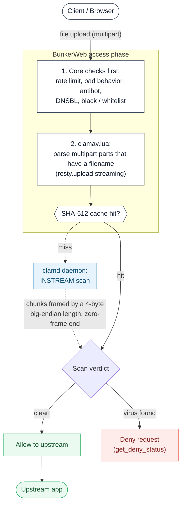

# ClamAV plugin




This [plugin](https://www.bunkerweb.io/latest/plugins/?utm_campaign=self&utm_source=github)
streams every uploaded file to a [ClamAV](https://www.clamav.net/) `clamd`
daemon and denies the request when the antivirus engine flags a file as
infected. It works on top of any existing service configuration - reverse
proxy, served files, custom location blocks - without replacing them.

The scan runs from Lua during BunkerWeb's access phase, so all of BunkerWeb's
built-in checks (rate limit, bad behavior, antibot, DNSBL, whitelist /
blacklist, ...) run _before_ any file is handed to `clamd`. Files are streamed
to `clamd` over its binary INSTREAM protocol on a TCP socket - not HTTP. At
worker startup the plugin pings `clamd` to verify connectivity, and it exposes
a `POST /clamav/ping` health endpoint used by the BunkerWeb web UI.

# Table of contents

- [ClamAV plugin](#clamav-plugin)
- [Table of contents](#table-of-contents)
- [How it works](#how-it-works)
- [Prerequisites](#prerequisites)
- [Setup](#setup)
  - [Docker](#docker)
  - [Swarm](#swarm)
  - [Kubernetes](#kubernetes)
- [Settings](#settings)
- [Troubleshooting](#troubleshooting)
- [Notes](#notes)

# How it works

For a `multipart/form-data` upload to a protected site:

1. BunkerWeb's access-phase checks run first (rate limit, bad behavior,
   antibot, DNSBL, blacklist, ...). If any of them deny, the request stops
   here and `clamd` is never contacted.
2. `clamav.lua` runs. It only acts on `multipart/form-data` requests with a
   boundary; any other request (plain `POST`, JSON, GET, ...) is passed
   through untouched.
3. The handler streams the request body with `resty.upload` and inspects each
   part. It scans **only** the parts that carry a real filename in their
   `Content-Disposition` header - quoted (`filename="x"`), unquoted
   (`filename=x`) and RFC 5987 extended (`filename*=...`) forms are all
   recognized. Form fields without a filename are skipped.
4. As each scanned file streams in, its bytes are forwarded to the `clamd`
   daemon over the binary INSTREAM protocol on a TCP socket (each chunk framed
   by a 4-byte big-endian length prefix) while a SHA-512 checksum is computed.
5. When the part ends, the checksum is looked up in BunkerWeb's shared cache. On
   a **hit** the socket is closed without finalizing the scan and the cached
   verdict is reused. On a **miss** a zero-length frame terminates the stream,
   `clamd` returns its verdict on that line, and the result is cached for 24h.
6. **Clean** - the request continues to its normal destination (reverse proxy,
   file serving, custom location). **Detection** - the request is denied with
   BunkerWeb's deny status; the file's checksum and the matched signature name
   are written to the log.

# Prerequisites

Please read the [plugins section](https://docs.bunkerweb.io/latest/plugins/?utm_campaign=self&utm_source=github)
of the BunkerWeb documentation first.

You need a reachable `clamd` instance. The official `clamav/clamav` image
exposes `clamd` on TCP port `3310` and ships `freshclam` to keep the signature
database up to date; BunkerWeb only needs network access to that port.

# Setup

See the [plugins section](https://docs.bunkerweb.io/latest/plugins/?utm_campaign=self&utm_source=github)
of the BunkerWeb documentation for the generic installation procedure depending
on your integration (the short version: drop the `clamav/` directory into the
scheduler's `/data/plugins/` and restart).

`CLAMAV_HOST` / `CLAMAV_PORT` are the address BunkerWeb uses to reach `clamd` -
typically an internal Docker network address. They are **global** settings, so
one ClamAV backend serves every site; `USE_CLAMAV` is **multisite**, so you
enable scanning per service.

## Docker

```yaml
services:

  bunkerweb:
    image: bunkerity/bunkerweb:1.6.11
    ...
    networks:
      - bw-plugins
    ...

  bw-scheduler:
    image: bunkerity/bunkerweb-scheduler:1.6.11
    ...
    environment:
      USE_CLAMAV: "yes"
      CLAMAV_HOST: "clamav"
    ...

  clamav:
    image: clamav/clamav:1.4
    volumes:
      - ./clamav-data:/var/lib/clamav
    networks:
      - bw-plugins

networks:
  # BunkerWeb networks
  ...
  bw-plugins:
    name: bw-plugins
```

## Swarm

```yaml
services:

  bunkerweb:
    image: bunkerity/bunkerweb:1.6.11
    ...
    networks:
      - bw-plugins
    ...

  bw-scheduler:
    image: bunkerity/bunkerweb-scheduler:1.6.11
    ...
    environment:
      USE_CLAMAV: "yes"
      CLAMAV_HOST: "clamav"
    ...

  clamav:
    image: clamav/clamav:1.4
    networks:
      - bw-plugins

networks:
  # BunkerWeb networks
  ...
  bw-plugins:
    driver: overlay
    attachable: true
    name: bw-plugins
...
```

## Kubernetes

First you will need to deploy the ClamAV dependency:

```yaml
apiVersion: apps/v1
kind: Deployment
metadata:
  name: bunkerweb-clamav
spec:
  replicas: 1
  selector:
    matchLabels:
      app: bunkerweb-clamav
  template:
    metadata:
      labels:
        app: bunkerweb-clamav
    spec:
      containers:
        - name: bunkerweb-clamav
          image: clamav/clamav:1.4
---
apiVersion: v1
kind: Service
metadata:
  name: svc-bunkerweb-clamav
spec:
  selector:
    app: bunkerweb-clamav
  ports:
    - protocol: TCP
      port: 3310
      targetPort: 3310
```

Then you can configure the plugin:

```yaml
apiVersion: networking.k8s.io/v1
kind: Ingress
metadata:
  name: ingress
  annotations:
    bunkerweb.io/USE_CLAMAV: "yes"
    bunkerweb.io/CLAMAV_HOST: "svc-bunkerweb-clamav.default.svc.cluster.local"
```

# Settings

| Setting          | Default  | Context   | Multiple | Description                                                                            |
| ---------------- | -------- | --------- | -------- | -------------------------------------------------------------------------------------- |
| `USE_CLAMAV`     | `no`     | multisite | no       | Activate automatic scan of uploaded files with ClamAV.                                 |
| `CLAMAV_HOST`    | `clamav` | global    | no       | ClamAV hostname or IP address.                                                         |
| `CLAMAV_PORT`    | `3310`   | global    | no       | ClamAV port.                                                                           |
| `CLAMAV_TIMEOUT` | `1000`   | global    | no       | Network timeout in milliseconds when communicating with ClamAV (e.g. 1000 = 1 second). |

# Troubleshooting

- **Large files are not scanned.** `clamd` refuses any stream above its
  `StreamMaxLength` (set in `clamd.conf`, 25 MB by default in the official
  image). When that limit is hit, the plugin logs `size exceeded
StreamMaxLength in clamd.conf` and **skips** that file - it does not deny it.
  Raise `StreamMaxLength` (and `MaxFileSize` to match) in `clamd.conf` if you
  need to scan larger uploads.
- **`connectivity with ClamAV failed` in the scheduler / worker log.**
  BunkerWeb can't reach `clamd`. Check that the ClamAV service is up, on the
  same network as BunkerWeb, and that `CLAMAV_HOST` / `CLAMAV_PORT` point at it
  (default `clamav:3310`). The startup ping uses `CLAMAV_TIMEOUT` (default
  `1000` ms).
- **The first request after starting ClamAV is slow or times out.** The
  official `clamav/clamav` image loads its signature database on boot and isn't
  ready until `freshclam` completes the initial download. Wait for `clamd` to
  report ready, or raise `CLAMAV_TIMEOUT`.
- **Uploads aren't being scanned at all.** Only `multipart/form-data` requests
  that contain a part with a `Content-Disposition` filename are scanned. Plain
  `POST` bodies, JSON payloads, and form fields without a filename are skipped
  silently by design.

# Notes

- **Scan results are cached for 24 hours.** Verdicts are keyed by the file's
  SHA-512 checksum and stored in BunkerWeb's shared cache, so an identical
  re-upload skips a fresh `clamd` scan. The cache is shared across nginx workers
  in an instance, and across BunkerWeb instances when `USE_REDIS=yes`.
- **Detections are fail-closed; un-scannable files are not.** A file `clamd`
  flags as infected is denied with BunkerWeb's deny status, and its checksum
  and signature name are logged. A file that cannot be scanned - for example
  one larger than `StreamMaxLength` - is logged and allowed through. Scanning
  is best-effort for the parts `clamd` can read; it is not a hard gate on
  un-scannable uploads.
- **Clustered / replicated `clamd` is not yet validated.** Pointing
  `CLAMAV_HOST` at a load-balanced pool of `clamd` nodes should work, since the
  INSTREAM protocol is self-contained per connection, but this topology is not
  officially tested or documented yet.
