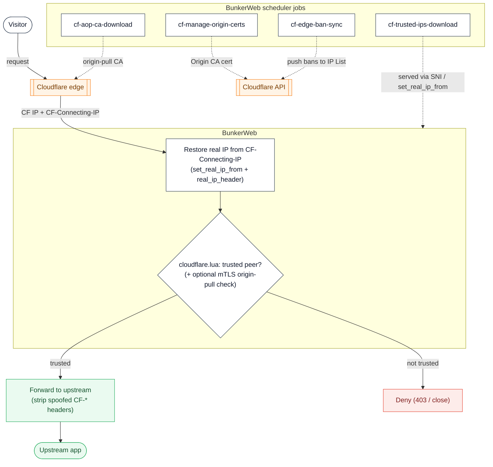

# Cloudflare plugin




This [plugin](https://www.bunkerweb.io/latest/plugins/?utm_campaign=self&utm_source=github)
makes BunkerWeb a first-class origin behind Cloudflare. It restores the real
client IP from `CF-Connecting-IP`, can deny any connection whose real peer is not
a Cloudflare (or additional-trusted) IP, strips spoofed `CF-*` headers, verifies
Cloudflare's Authenticated Origin Pulls (mTLS), and automatically provisions and
serves Cloudflare Origin CA certificates. A set of scheduler jobs keeps the
Cloudflare IP ranges, the origin-pull CA and the Origin CA certificates current,
and can push BunkerWeb's active bans up to a Cloudflare edge IP List.

The per-request trust check runs from Lua during BunkerWeb's `access` phase (and
`preread` for stream), so all of BunkerWeb's built-in checks run as usual. The
deny decision is taken on `realip_remote_addr` — the real TCP peer of the
connection — so it cannot be spoofed by a forged header. The whole trust check
**fails open**: while the trusted-IP list is still empty (for example right after
boot, before the first download job runs) the plugin never denies, so a
misconfiguration or a slow first job can never lock everyone out.

# Table of contents

- [Cloudflare plugin](#cloudflare-plugin)
- [Table of contents](#table-of-contents)
- [How it works](#how-it-works)
- [Prerequisites](#prerequisites)
  - [Cloudflare API token](#cloudflare-api-token)
- [Setup](#setup)
  - [Docker / Swarm](#docker--swarm)
  - [Linux](#linux)
- [Secrets](#secrets)
- [Settings](#settings)
- [Troubleshooting](#troubleshooting)
- [Notes](#notes)

# How it works

The plugin has two halves: per-request Lua hooks in the BunkerWeb instance, and
scheduled jobs in the BunkerWeb scheduler.

**Per request (`cloudflare.lua`):**

1. NGINX restores the real client IP. The plugin's config snippet emits
   `set_real_ip_from` for every downloaded Cloudflare range (and any
   `CLOUDFLARE_ADDITIONAL_TRUSTED_FROM` network). When `CLOUDFLARE_AUTO_REAL_IP`
   is `yes` **and** the core Real IP plugin is off (`USE_REAL_IP != yes`), it
   also emits `real_ip_header <CLOUDFLARE_REAL_IP_HEADER>` and
   `real_ip_recursive off`, so the visitor IP is restored from
   `CF-Connecting-IP` with no extra settings.
2. In the HTTP `access` phase, if `CLOUDFLARE_AUTHENTICATED_ORIGIN_PULLS=yes`
   (and the core mTLS plugin is off), the handler checks NGINX's
   `$ssl_client_verify`. If the origin-pull CA isn't loaded yet it warns and
   allows (fail open); otherwise a non-`SUCCESS` verify is treated as a
   non-Cloudflare origin — denied in `enforce` mode, only logged in `log` mode.
3. The handler then computes a trust verdict for `realip_remote_addr` against the
   Cloudflare ranges plus the additional-trusted list (results cached per server
   for 24 h). If the peer is untrusted and `CLOUDFLARE_STRIP_SPOOFED_HEADERS=yes`,
   the client-supplied `CF-*` headers (`CF-Connecting-IP`, `CF-IPCountry`,
   `CF-RAY`, `True-Client-IP`, ...) are stripped. If `CLOUDFLARE_DENY_NON_TRUSTED_IPS=yes`
   and the peer is untrusted, the request is denied. The stream `preread` phase
   enforces only the IP trust check (no header stripping, no mTLS).
4. On a TLS handshake, the `ssl_certificate` hook serves the managed Origin CA
   certificate/key for the requested SNI (parsed cert and key are kept in the
   worker `internalstore`, like the core Let's Encrypt plugin, so private keys
   never reach the API-exposed datastore). HTTPS is only advertised for a server
   once a certificate has actually been loaded.

**Scheduler jobs (declared in `plugin.json`, scripts under `jobs/`):**

| Job                       | Schedule     | What it does                                                                                                                                                 |
| ------------------------- | ------------ | ------------------------------------------------------------------------------------------------------------------------------------------------------------ |
| `cf-trusted-ips-download` | daily        | Downloads Cloudflare's published IPv4/IPv6 ranges to `ipv4.list`/`ipv6.list`, which feed `set_real_ip_from` and the per-request trust check. Needs no token. |
| `cf-manage-origin-certs`  | daily        | Uses the official `cloudflare` Python SDK to provision/renew a per-server Origin CA certificate + key, served by the `ssl_certificate` hook.                 |
| `cf-aop-ca-download`      | weekly       | Downloads Cloudflare's Authenticated Origin Pull CA to `aop_ca.pem`, wired into `ssl_client_certificate` for mTLS verification.                              |
| `cf-edge-ban-sync`        | every minute | Reads BunkerWeb's active bans from Redis and pushes up to 10,000 IPs to a Cloudflare account IP List, creating the list if it is missing.                    |

# Prerequisites

Please read the [plugins section](https://docs.bunkerweb.io/latest/plugins) of the BunkerWeb documentation first and refer to the [Cloudflare API documentation](https://developers.cloudflare.com/api) for more information.

Trusted-IP download and the deny feature need **no** API token. The other features need a token whose scope depends on what you enable:

| Feature                                   | Least-privilege token scope                                                   |
| ----------------------------------------- | ----------------------------------------------------------------------------- |
| Origin CA certificates                    | `Zone:SSL and Certificates:Edit` (+ `Zone:Zone:Read` for zone auto-discovery) |
| Authenticated Origin Pulls (global, mTLS) | none (static CA is downloaded from a public URL)                              |
| Edge ban sync                             | `Account:Account Filter Lists:Edit`                                           |

> [!NOTE]
> Edge ban sync uses an **account-scoped** token, which is broader than the zone token used elsewhere — keep it in the dedicated `CLOUDFLARE_EDGE_BAN_API_TOKEN` setting for least privilege.

## Cloudflare API token

To create an API token for Origin CA certificate management:

1. Log in to your Cloudflare account.
2. Go to the [API Tokens](https://dash.cloudflare.com/profile/api-tokens) page.
3. Click `Create Token` → `Create Custom Token`.
4. Under `Permissions`, add `Zone:SSL and Certificates:Edit` (and optionally `Zone:Zone:Read`).
5. Under `Zone Resources`, select the zone(s) you want to manage.
6. Create the token and copy it into `CLOUDFLARE_API_TOKEN`.

<p align="center">
	
</p>

> [!NOTE]
> If you don't set `CLOUDFLARE_ZONE_ID`, the plugin resolves the zone from your domains via the API (needs `Zone:Zone:Read`). For second-level ccTLDs (e.g. `example.co.uk`) set `CLOUDFLARE_ZONE_ID` explicitly.

# Setup

See the [plugins section](https://docs.bunkerweb.io/latest/plugins) of the BunkerWeb documentation for the installation procedure depending on your integration (the short version: drop the `cloudflare/` directory into the scheduler's `/data/plugins/` and restart).

## Docker / Swarm

Set the Cloudflare settings on the **scheduler** service — that is where the plugin's jobs run and where BunkerWeb reads its configuration.

```yaml
services:
  bunkerweb:
    image: bunkerity/bunkerweb:1.6.11
    ...
    networks:
      - bw-services

  bw-scheduler:
    image: bunkerity/bunkerweb-scheduler:1.6.11
    ...
    environment:
      SERVER_NAME: "app.example.com"
      USE_REVERSE_PROXY: "yes"
      REVERSE_PROXY_HOST: "http://app:3000"
      REVERSE_PROXY_URL: "/"

      USE_CLOUDFLARE: "yes" # Mandatory
      CLOUDFLARE_DENY_NON_TRUSTED_IPS: "yes" # Optional: only accept connections from Cloudflare
      # Origin CA certificate management (optional)
      CLOUDFLARE_API_TOKEN: "<your_cloudflare_api_token>"
      CLOUDFLARE_MANAGE_ORIGIN_CERTS: "yes"
      # Authenticated Origin Pulls (optional)
      CLOUDFLARE_AUTHENTICATED_ORIGIN_PULLS: "yes"
      CLOUDFLARE_AOP_MODE: "enforce" # default "log"

networks:
  bw-services:
    name: bw-services
```

> [!NOTE]
> You no longer need to set `USE_REAL_IP`/`REAL_IP_HEADER` manually: with `CLOUDFLARE_AUTO_REAL_IP=yes` (default) the plugin configures NGINX real IP for Cloudflare itself. Disable it if the core Real IP plugin already manages those directives.

## Linux

```env
USE_CLOUDFLARE="yes"
CLOUDFLARE_DENY_NON_TRUSTED_IPS="yes"
CLOUDFLARE_API_TOKEN="<your_cloudflare_api_token>"
CLOUDFLARE_MANAGE_ORIGIN_CERTS="yes"
```

# Secrets

`CLOUDFLARE_API_TOKEN`, `CLOUDFLARE_ZONE_ID`, `CLOUDFLARE_ACCOUNT_ID` and `CLOUDFLARE_EDGE_BAN_API_TOKEN` support the Docker-secret `<NAME>_FILE` convention: set e.g. `CLOUDFLARE_API_TOKEN_FILE=/run/secrets/cf_token` and the value is read from that file.

# Settings

| Setting                                 | Default                                                                         | Context   | Multiple | Description                                                                                                                                                                                                                                                                                          |
| --------------------------------------- | ------------------------------------------------------------------------------- | --------- | -------- | ---------------------------------------------------------------------------------------------------------------------------------------------------------------------------------------------------------------------------------------------------------------------------------------------------- |
| `USE_CLOUDFLARE`                        | `no`                                                                            | multisite | no       | Activate Cloudflare automations (real IP, trusted-IP allowlisting, Origin CA certificates, mTLS, ...).                                                                                                                                                                                               |
| `CLOUDFLARE_API_TOKEN`                  |                                                                                 | multisite | no       | Cloudflare API token to authenticate with the Cloudflare API.                                                                                                                                                                                                                                        |
| `CLOUDFLARE_ZONE_ID`                    |                                                                                 | multisite | no       | Cloudflare Zone ID (if no zone ID is provided, the plugin will try to get it from the API).                                                                                                                                                                                                          |
| `CLOUDFLARE_MANAGE_ORIGIN_CERTS`        | `yes`                                                                           | multisite | no       | Activate automatic management of Origin CA certificates.                                                                                                                                                                                                                                             |
| `CLOUDFLARE_ORIGIN_CERT_TYPE`           | `rsa`                                                                           | multisite | no       | Signature type desired on origin CA certificates ("rsa", or "ecdsa").                                                                                                                                                                                                                                |
| `CLOUDFLARE_ORIGIN_CERT_VALIDITY`       | `5475`                                                                          | multisite | no       | Validity period of origin CA certificates in days.                                                                                                                                                                                                                                                   |
| `CLOUDFLARE_ADDITIONAL_TRUSTED_FROM`    |                                                                                 | multisite | no       | Additional IPs/networks to consider as trusted, separated with spaces (CIDR notation).                                                                                                                                                                                                               |
| `CLOUDFLARE_DENY_NON_TRUSTED_IPS`       | `no`                                                                            | multisite | no       | Deny access to non-trusted IPs (the ones not in Cloudflare's official list and the additional trusted IPs).                                                                                                                                                                                          |
| `CLOUDFLARE_API_URL`                    | `https://api.cloudflare.com/client/v4`                                          | global    | no       | Base URL of the Cloudflare API (advanced; for a Cloudflare-compatible/proxied endpoint or testing).                                                                                                                                                                                                  |
| `CLOUDFLARE_API_TIMEOUT`                | `10`                                                                            | global    | no       | Timeout in seconds for Cloudflare API requests.                                                                                                                                                                                                                                                      |
| `CLOUDFLARE_IPS_V4_URL`                 | `https://www.cloudflare.com/ips-v4/`                                            | global    | no       | URL to download Cloudflare's IPv4 ranges from (advanced/testing).                                                                                                                                                                                                                                    |
| `CLOUDFLARE_IPS_V6_URL`                 | `https://www.cloudflare.com/ips-v6/`                                            | global    | no       | URL to download Cloudflare's IPv6 ranges from (advanced/testing).                                                                                                                                                                                                                                    |
| `CLOUDFLARE_AUTO_REAL_IP`               | `yes`                                                                           | multisite | no       | Automatically configure NGINX real_ip_header/real_ip_recursive for Cloudflare. Disable if the core Real IP plugin (USE_REAL_IP) already manages them to avoid duplicate directives.                                                                                                                  |
| `CLOUDFLARE_REAL_IP_HEADER`             | `CF-Connecting-IP`                                                              | multisite | no       | Header carrying the real client IP. CF-Connecting-IP (default), True-Client-IP (Enterprise alias) or CF-Connecting-IPv6 (when Pseudo-IPv4 is enabled).                                                                                                                                               |
| `CLOUDFLARE_STRIP_SPOOFED_HEADERS`      | `yes`                                                                           | multisite | no       | Strip client-supplied CF-\* headers (CF-Connecting-IP, CF-IPCountry, CF-RAY, True-Client-IP, ...) when the connection is not from a trusted Cloudflare IP, to prevent spoofing.                                                                                                                      |
| `CLOUDFLARE_AUTHENTICATED_ORIGIN_PULLS` | `no`                                                                            | multisite | no       | Require Cloudflare Authenticated Origin Pulls (mTLS): verify the connection presents Cloudflare's origin-pull client certificate. Mutually exclusive with the core mTLS plugin on the same server.                                                                                                   |
| `CLOUDFLARE_AOP_MODE`                   | `log`                                                                           | multisite | no       | Authenticated Origin Pulls enforcement: 'log' only warns on connections without a valid Cloudflare client certificate, 'enforce' denies them.                                                                                                                                                        |
| `CLOUDFLARE_AOP_CA_URL`                 | `https://developers.cloudflare.com/ssl/static/authenticated_origin_pull_ca.pem` | global    | no       | URL of the Cloudflare Authenticated Origin Pull CA certificate (advanced/testing).                                                                                                                                                                                                                   |
| `USE_CLOUDFLARE_EDGE_BAN_SYNC`          | `no`                                                                            | global    | no       | Push BunkerWeb's active bans to a Cloudflare account IP List. Reference that list from a Cloudflare WAF custom rule to block the offenders at the edge (the plugin syncs the list, it does not create the rule). Requires USE_REDIS=yes and an account-scoped API token (Account Filter Lists:Edit). |
| `CLOUDFLARE_ACCOUNT_ID`                 |                                                                                 | global    | no       | Cloudflare Account ID owning the edge ban IP List.                                                                                                                                                                                                                                                   |
| `CLOUDFLARE_BAN_LIST_NAME`              | `bunkerweb_bans`                                                                | global    | no       | Name of the Cloudflare account IP List used for edge ban sync (lowercase letters, digits and underscores).                                                                                                                                                                                           |
| `CLOUDFLARE_EDGE_BAN_API_TOKEN`         |                                                                                 | global    | no       | Account-scoped API token (Account Filter Lists:Edit) for edge ban sync. Falls back to CLOUDFLARE_API_TOKEN if empty.                                                                                                                                                                                 |

# Troubleshooting

- **No requests are denied even with `CLOUDFLARE_DENY_NON_TRUSTED_IPS=yes`.** The
  trust check fails open until the trusted-IP list is populated. Confirm the
  `cf-trusted-ips-download` job has run (check the scheduler logs, or `POST` to
  `/cloudflare/ping`, which reports how many IPv4/IPv6 ranges are loaded). The
  job runs daily; after the first scheduler start it may take a moment.
- **Duplicate-directive errors at NGINX reload (`real_ip_header`, `ssl_verify_client`).**
  Don't enable both this plugin and the core Real IP / core mTLS plugin as the
  owner of the same directive on the same server. The plugin already gates its
  config so it won't clash (real IP is only emitted when `CLOUDFLARE_AUTO_REAL_IP=yes`
  and `USE_REAL_IP != yes`; the AOP `ssl_verify_client` only when `USE_MTLS != yes`),
  but pick a single owner — either disable `CLOUDFLARE_AUTO_REAL_IP` or don't
  enable the core plugin.
- **The real client IP is still Cloudflare's edge IP.** The real-IP config is
  only emitted once the Cloudflare ranges have been downloaded and
  `CLOUDFLARE_AUTO_REAL_IP=yes` (with the core Real IP plugin off). Verify the
  download job ran and that `CLOUDFLARE_REAL_IP_HEADER` matches the header
  Cloudflare actually sends for your plan.
- **HTTPS is never advertised for a server.** A server is only marked
  HTTPS-configured once `cf-manage-origin-certs` has successfully obtained and
  loaded an Origin CA certificate for it. Check that `CLOUDFLARE_API_TOKEN` is
  set, `CLOUDFLARE_MANAGE_ORIGIN_CERTS=yes`, and the token has
  `Zone:SSL and Certificates:Edit` (plus `Zone:Zone:Read` if you didn't set
  `CLOUDFLARE_ZONE_ID`).
- **Authenticated Origin Pulls denies legitimate traffic (or never enforces).**
  In `enforce` mode the plugin denies any connection whose `$ssl_client_verify`
  isn't `SUCCESS` — but only once `cf-aop-ca-download` has written the origin-pull
  CA; until then it fails open and only warns. If you also run the core mTLS
  plugin (`USE_MTLS=yes`), the AOP check is skipped because `$ssl_client_verify`
  would then reflect the core plugin's CA, not Cloudflare's.
- **Edge ban sync does nothing.** It requires `USE_CLOUDFLARE_EDGE_BAN_SYNC=yes`,
  `USE_REDIS=yes` (bans are read from Redis), a `CLOUDFLARE_ACCOUNT_ID`, and an
  account-scoped token (`CLOUDFLARE_EDGE_BAN_API_TOKEN`, falling back to
  `CLOUDFLARE_API_TOKEN`) with `Account Filter Lists:Edit`. The job logs the
  reason it skips.

# Notes

- **Fail-open by design.** Both the IP trust check and the Authenticated Origin
  Pulls check fail open while their backing data isn't loaded yet (the trusted-IP
  list right after boot, the origin-pull CA before `cf-aop-ca-download` runs). The
  plugin therefore can't lock everyone out during the brief window before its
  jobs have populated their lists.
- **The deny decision can't be spoofed.** The trust verdict is computed against
  `realip_remote_addr` — the real TCP peer of the connection — not against any
  client-supplied header, so an attacker connecting directly to the origin can't
  forge their way past it. As defence in depth, untrusted peers also have their
  client-supplied `CF-*` headers stripped (`CLOUDFLARE_STRIP_SPOOFED_HEADERS`).
- **One owner for real IP and mTLS.** This plugin and BunkerWeb's core Real IP /
  mTLS plugins manage the same NGINX directives. The plugin gates its config to
  avoid duplicate directives, but you should still let a single plugin own each
  feature on a given server.
- **Stream support is partial.** In the stream (`preread`) context only the IP
  trust check runs — there is no header stripping and no mTLS, and real IP relies
  on the PROXY protocol (`real_ip_header` is HTTP-only).
- **Edge ban sync only maintains the IP List.** The job creates and fills the
  Cloudflare account IP List named by `CLOUDFLARE_BAN_LIST_NAME`; it does **not**
  create a firewall rule. To actually block the banned IPs at the edge, add a
  Cloudflare WAF custom rule that references that IP List.
- **Edge ban sync is capped at 10,000 IPs.** That is Cloudflare's default
  per-account IP List capacity; if more IPs are banned, the lowest-sorted 10,000
  are synced and the rest are skipped (with a warning in the scheduler logs).
- **Account-scoped token is broader.** Edge ban sync needs an account-scoped
  token, which grants more than the zone-scoped token used for Origin CA
  certificates. Keep it in `CLOUDFLARE_EDGE_BAN_API_TOKEN` rather than reusing
  `CLOUDFLARE_API_TOKEN`, and both support the `<NAME>_FILE` secret convention.
