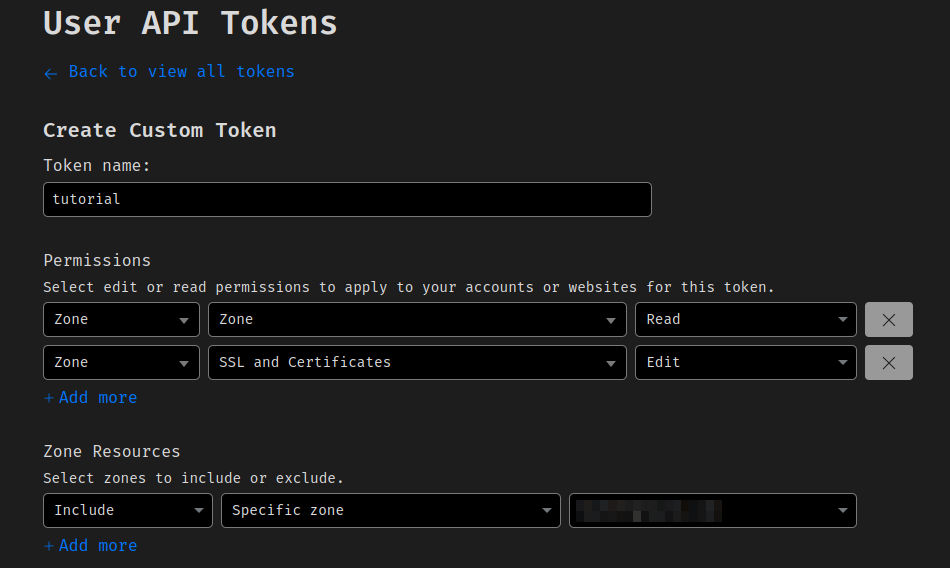

# Cloudflare plugin


This [BunkerWeb](https://github.com/bunkerity/bunkerweb) plugin makes BunkerWeb a first-class origin behind Cloudflare:

- **Trusted Cloudflare IPs & real client IP** — a daily job downloads Cloudflare's official IPv4/IPv6 ranges and feeds them to NGINX (`set_real_ip_from`). When `CLOUDFLARE_AUTO_REAL_IP` is enabled (default) the plugin also configures `real_ip_header`/`real_ip_recursive` for you, so the real visitor IP is restored from `CF-Connecting-IP` with no extra settings.
- **Deny non-Cloudflare traffic** — optionally block any connection whose real peer isn't a Cloudflare (or additional-trusted) IP, in both HTTP and stream.
- **Spoofed-header stripping** — strip client-supplied `CF-*` headers from connections that don't come from Cloudflare.
- **Authenticated Origin Pulls (mTLS)** — cryptographically verify that the connection was terminated by Cloudflare by checking its origin-pull client certificate, in `log` or `enforce` mode.
- **Origin CA certificates** — automatically obtain and renew Cloudflare Origin CA certificates via the Cloudflare API and serve them over SNI.
- **Edge ban sync** — push BunkerWeb's active bans to a Cloudflare account IP List so repeat offenders are dropped at Cloudflare's edge.

# Table of contents

- [Cloudflare plugin](#cloudflare-plugin)
- [Prerequisites](#prerequisites)
  - [Cloudflare API token](#cloudflare-api-token)
- [Setup](#setup)
  - [Docker/Swarm](#dockerswarm)
  - [Linux](#linux)
- [Secrets](#secrets)
- [Settings](#settings)

# Prerequisites

Please read the [plugins section](https://docs.bunkerweb.io/latest/plugins) of the BunkerWeb documentation first and refer to the [Cloudflare API documentation](https://developers.cloudflare.com/api) for more information.

Trusted-IP download and the deny feature need **no** API token. The other features need a token whose scope depends on what you enable:

| Feature                                   | Least-privilege token scope                                                                 |
| ----------------------------------------- | ------------------------------------------------------------------------------------------- |
| Origin CA certificates                    | `Zone:SSL and Certificates:Edit` (+ `Zone:Zone:Read` for zone auto-discovery)               |
| Authenticated Origin Pulls (global, mTLS) | none (static CA is downloaded from a public URL)                                            |
| Edge ban sync                             | `Account:Account Filter Lists:Edit` (+ `Account:WAF:Edit` to auto-create the blocking rule) |

> [!NOTE]
> Edge ban sync uses an **account-scoped** token, which is broader than the zone token used elsewhere — keep it in the dedicated `CLOUDFLARE_EDGE_BAN_API_TOKEN` setting for least privilege.

## Cloudflare API token

To create an API token for Origin CA certificate management:

1. Log in to your Cloudflare account.
2. Go to the [API Tokens](https://dash.cloudflare.com/profile/api-tokens) page.
3. Click `Create Token` → `Create Custom Token`.
4. Under `Permissions`, add `Zone:SSL and Certificates:Edit` (and optionally `Zone:Zone:Read`).
5. Under `Zone Resources`, select the zone(s) you want to manage.
6. Create the token and copy it into `CLOUDFLARE_API_TOKEN`.

<p align="center">
	
</p>

> [!NOTE]
> If you don't set `CLOUDFLARE_ZONE_ID`, the plugin resolves the zone from your domains via the API (needs `Zone:Zone:Read`). For second-level ccTLDs (e.g. `example.co.uk`) set `CLOUDFLARE_ZONE_ID` explicitly.

# Setup

See the [plugins section](https://docs.bunkerweb.io/latest/plugins) of the BunkerWeb documentation for the installation procedure depending on your integration.

## Docker/Swarm

```yaml
services:
  ...
    # BunkerWeb scheduler
    environment:
      ...
      USE_CLOUDFLARE: "yes" # Mandatory
      CLOUDFLARE_DENY_NON_TRUSTED_IPS: "yes" # Optional: only accept connections from Cloudflare
      # Origin CA certificate management (optional)
      CLOUDFLARE_API_TOKEN: "<your_cloudflare_api_token>"
      CLOUDFLARE_MANAGE_ORIGIN_CERTS: "yes"
      # Authenticated Origin Pulls (optional)
      CLOUDFLARE_AUTHENTICATED_ORIGIN_PULLS: "yes"
      CLOUDFLARE_AOP_MODE: "enforce" # default "log"
```

> [!NOTE]
> You no longer need to set `USE_REAL_IP`/`REAL_IP_HEADER` manually: with `CLOUDFLARE_AUTO_REAL_IP=yes` (default) the plugin configures NGINX real-IP for Cloudflare itself. Disable it if the core Real IP plugin already manages those directives.

## Linux

```env
USE_CLOUDFLARE="yes"
CLOUDFLARE_DENY_NON_TRUSTED_IPS="yes"
CLOUDFLARE_API_TOKEN="<your_cloudflare_api_token>"
CLOUDFLARE_MANAGE_ORIGIN_CERTS="yes"
```

# Secrets

`CLOUDFLARE_API_TOKEN`, `CLOUDFLARE_ZONE_ID`, `CLOUDFLARE_ACCOUNT_ID` and `CLOUDFLARE_EDGE_BAN_API_TOKEN` support the Docker-secret `<NAME>_FILE` convention: set e.g. `CLOUDFLARE_API_TOKEN_FILE=/run/secrets/cf_token` and the value is read from that file.

# Settings

| Setting                                 | Default                                                                         | Context   | Multiple | Description                                                                                                                                                                                        |
| --------------------------------------- | ------------------------------------------------------------------------------- | --------- | -------- | -------------------------------------------------------------------------------------------------------------------------------------------------------------------------------------------------- |
| `USE_CLOUDFLARE`                        | `no`                                                                            | multisite | no       | Activate Cloudflare automations (real IP, trusted-IP allowlisting, Origin CA certificates, mTLS, ...).                                                                                             |
| `CLOUDFLARE_API_TOKEN`                  |                                                                                 | multisite | no       | Cloudflare API token to authenticate with the Cloudflare API.                                                                                                                                      |
| `CLOUDFLARE_ZONE_ID`                    |                                                                                 | multisite | no       | Cloudflare Zone ID (if no zone ID is provided, the plugin will try to get it from the API).                                                                                                        |
| `CLOUDFLARE_MANAGE_ORIGIN_CERTS`        | `yes`                                                                           | multisite | no       | Activate automatic management of Origin CA certificates.                                                                                                                                           |
| `CLOUDFLARE_ORIGIN_CERT_TYPE`           | `rsa`                                                                           | multisite | no       | Signature type desired on origin CA certificates ("rsa", or "ecdsa").                                                                                                                              |
| `CLOUDFLARE_ORIGIN_CERT_VALIDITY`       | `5475`                                                                          | multisite | no       | Validity period of origin CA certificates in days.                                                                                                                                                 |
| `CLOUDFLARE_ADDITIONAL_TRUSTED_FROM`    |                                                                                 | multisite | no       | Additional IPs/networks to consider as trusted, separated with spaces (CIDR notation).                                                                                                             |
| `CLOUDFLARE_DENY_NON_TRUSTED_IPS`       | `no`                                                                            | multisite | no       | Deny access to non-trusted IPs (the ones not in Cloudflare's official list and the additional trusted IPs).                                                                                        |
| `CLOUDFLARE_API_URL`                    | `https://api.cloudflare.com/client/v4`                                          | global    | no       | Base URL of the Cloudflare API (advanced; for a Cloudflare-compatible/proxied endpoint or testing).                                                                                                |
| `CLOUDFLARE_API_TIMEOUT`                | `10`                                                                            | global    | no       | Timeout in seconds for Cloudflare API requests.                                                                                                                                                    |
| `CLOUDFLARE_IPS_V4_URL`                 | `https://www.cloudflare.com/ips-v4/`                                            | global    | no       | URL to download Cloudflare's IPv4 ranges from (advanced/testing).                                                                                                                                  |
| `CLOUDFLARE_IPS_V6_URL`                 | `https://www.cloudflare.com/ips-v6/`                                            | global    | no       | URL to download Cloudflare's IPv6 ranges from (advanced/testing).                                                                                                                                  |
| `CLOUDFLARE_AUTO_REAL_IP`               | `yes`                                                                           | multisite | no       | Automatically configure NGINX real_ip_header/real_ip_recursive for Cloudflare. Disable if the core Real IP plugin (USE_REAL_IP) already manages them to avoid duplicate directives.                |
| `CLOUDFLARE_REAL_IP_HEADER`             | `CF-Connecting-IP`                                                              | multisite | no       | Header carrying the real client IP. CF-Connecting-IP (default), True-Client-IP (Enterprise alias) or CF-Connecting-IPv6 (when Pseudo-IPv4 is enabled).                                             |
| `CLOUDFLARE_STRIP_SPOOFED_HEADERS`      | `yes`                                                                           | multisite | no       | Strip client-supplied CF-\* headers (CF-Connecting-IP, CF-IPCountry, CF-RAY, True-Client-IP, ...) when the connection is not from a trusted Cloudflare IP, to prevent spoofing.                    |
| `CLOUDFLARE_AUTHENTICATED_ORIGIN_PULLS` | `no`                                                                            | multisite | no       | Require Cloudflare Authenticated Origin Pulls (mTLS): verify the connection presents Cloudflare's origin-pull client certificate. Mutually exclusive with the core mTLS plugin on the same server. |
| `CLOUDFLARE_AOP_MODE`                   | `log`                                                                           | multisite | no       | Authenticated Origin Pulls enforcement: 'log' only warns on connections without a valid Cloudflare client certificate, 'enforce' denies them.                                                      |
| `CLOUDFLARE_AOP_CA_URL`                 | `https://developers.cloudflare.com/ssl/static/authenticated_origin_pull_ca.pem` | global    | no       | URL of the Cloudflare Authenticated Origin Pull CA certificate (advanced/testing).                                                                                                                 |
| `USE_CLOUDFLARE_EDGE_BAN_SYNC`          | `no`                                                                            | global    | no       | Push BunkerWeb's active bans to a Cloudflare account IP List so offenders are blocked at the edge. Requires USE_REDIS=yes and an account-scoped API token (Account Filter Lists:Edit).             |
| `CLOUDFLARE_ACCOUNT_ID`                 |                                                                                 | global    | no       | Cloudflare Account ID owning the edge ban IP List.                                                                                                                                                 |
| `CLOUDFLARE_BAN_LIST_NAME`              | `bunkerweb_bans`                                                                | global    | no       | Name of the Cloudflare account IP List used for edge ban sync (lowercase letters, digits and underscores).                                                                                         |
| `CLOUDFLARE_EDGE_BAN_API_TOKEN`         |                                                                                 | global    | no       | Account-scoped API token (Account Filter Lists:Edit, optionally Account WAF:Edit) for edge ban sync. Falls back to CLOUDFLARE_API_TOKEN if empty.                                                  |
