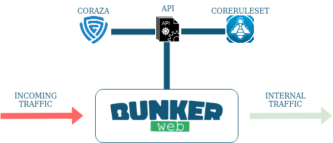

# Coraza plugin

<p align="center">
	
</p>


This [Plugin](https://www.bunkerweb.io/latest/plugins) will act as a Library of rule that aim to detect and deny malicious requests 

# Table of contents

- [Coraza plugin](#coraza-plugin)
- [Table of contents](#table-of-contents)
- [Prerequisites](#prerequisites)
- [Setup](#setup)
  * [Docker](#docker)
- [Settings](#settings)
  * [Plugin (BunkerWeb)](#plugin--bunkerweb-)
- [TODO](#todo)

# Prerequisites

Please read the [plugins section](https://docs.bunkerweb.io/latest/plugins) of the BunkerWeb documentation first.

# Setup

See the [plugins section](https://docs.bunkerweb.io/latest/plugins) of the BunkerWeb documentation for the installation procedure depending on your integration.

## Docker 

```yaml

version: '3'

services:

  bunkerweb:
    image: bunkerity/bunkerweb:1.5.0
    ...
    environment:
      - USE_MODSECURITY: "no" # We don't need modsecurity anymore
      - USE_CORAZA: "yes"
    ...
    bw-coraza:
      build: /path/to/coraza-plugin
      networks:
        - bw-universe

```

# Settings

## Plugin (BunkerWeb)

| Setting      | Default                  | Description                                                                                    |
| :----------: | :----------------------: | :--------------------------------------------------------------------------------------------- |
| `USE_CORAZA` | `no`                     | When set to `yes`, requests will be checked by coraza.                                         |
| `CORAZA_API` | `http://bw-coraza:8080`  | Address of the coraza library (request will be redirected there).                              |

! Disclaimer the `CORAZA_API` port (by default 8080) can't be modified in the plugin.json. You also need to change it in the main.go (/data/plugins/coraza/confs/main.go)

# TODO

Fix the port problem.

Add the conf request to personalize the coreruleset and other parameters directly from bunkerweb (not by hands).

