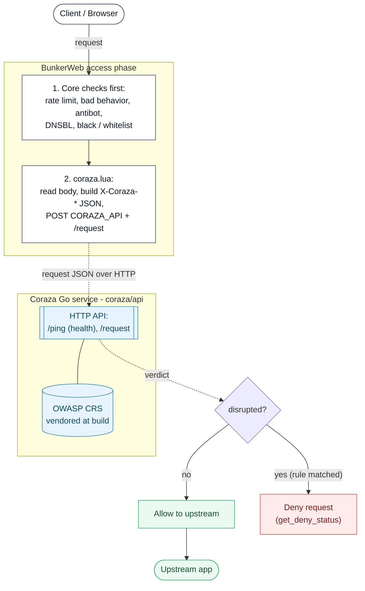

# Coraza plugin


```mermaid
flowchart TD
    accTitle: BunkerWeb Coraza plugin request flow
    accDescr: A client request first passes BunkerWeb core checks, then coraza.lua forwards the request metadata and body as JSON over HTTP to the Coraza Go sidecar. The sidecar evaluates the OWASP Core Rule Set and returns a verdict. A disrupted verdict denies the request, otherwise it reaches the upstream.

    client([Client / Browser])

    subgraph bw[BunkerWeb access phase]
        direction TB
        core["1. Core checks first:<br/>rate limit, bad behavior, antibot,<br/>DNSBL, black / whitelist"]
        lua["2. coraza.lua:<br/>read body, build X-Coraza-* JSON,<br/>POST CORAZA_API + /request"]
        core --> lua
    end

    subgraph sidecar[Coraza Go service - coraza/api]
        direction TB
        api[["HTTP API:<br/>/ping (health), /request"]]
        crs[("OWASP CRS<br/>vendored at build")]
        api --- crs
    end

    verdict{"disrupted?"}
    allow["Allow to upstream"]
    deny["Deny request<br/>(get_deny_status)"]
    upstream([Upstream app])

    client -->|request| core
    lua -.->|"request JSON over HTTP"| api
    api -.->|verdict| verdict
    verdict -->|"yes (rule matched)"| deny
    verdict -->|no| allow
    allow --> upstream

    classDef ok fill:#eafaf0,stroke:#27ae60,color:#14532d;
    classDef deny fill:#fdecea,stroke:#e74c3c,color:#7f1d1d;
    classDef svc fill:#e8f4fd,stroke:#2980b9,color:#0c4a6e;
    classDef app fill:#ffffff,stroke:#334155,color:#0f172a;
    class allow,upstream ok;
    class deny deny;
    class api,crs svc;
    class client,core,lua app;
```

This [Plugin](https://www.bunkerweb.io/latest/plugins/?utm_campaign=self&utm_source=github) will act as a Library of rule that aim to detect and deny malicious requests

# Table of contents

- [Coraza plugin](#coraza-plugin)
- [Table of contents](#table-of-contents)
- [Setup](#setup)
  - [Docker/Swarm](#dockerswarm)
- [Settings](#settings)
- [TODO](#todo)

# Setup

See the [plugins section](https://docs.bunkerweb.io/latest/plugins/?utm_campaign=self&utm_source=github) of the BunkerWeb documentation for the installation procedure depending on your integration.

## Docker/Swarm

```yaml
services:

  bunkerweb:
    image: bunkerity/bunkerweb:1.6.0-rc1
    ...
    networks:
      - bw-plugins
    ...

  bw-scheduler:
    image: bunkerity/bunkerweb-scheduler:1.6.0-rc1
    ...
    environment:
      HTTP2: "no" # The Coraza plugin doesn't support HTTP2 yet
      USE_MODSECURITY: "no" # We don't need ModSecurity anymore
      USE_CORAZA: "yes"
      CORAZA_API: "http://bw-coraza:8080" # This is the address of the coraza container in the same network

  ...

  bw-coraza:
    image: bunkerity/bunkerweb-coraza:1.6.0-rc1
    networks:
      - bw-plugins

networks:
  # BunkerWeb networks
  ...
  bw-plugins:
    name: bw-plugins
```

# Settings

| Setting      | Default                 | Context   | Multiple | Description                 |
| ------------ | ----------------------- | --------- | -------- | --------------------------- |
| `USE_CORAZA` | `no`                    | multisite | no       | Activate Coraza library     |
| `CORAZA_API` | `http://bw-coraza:8080` | global    | no       | hostname of the CORAZA API. |

# TODO

- Don't use API container
- More documentation
