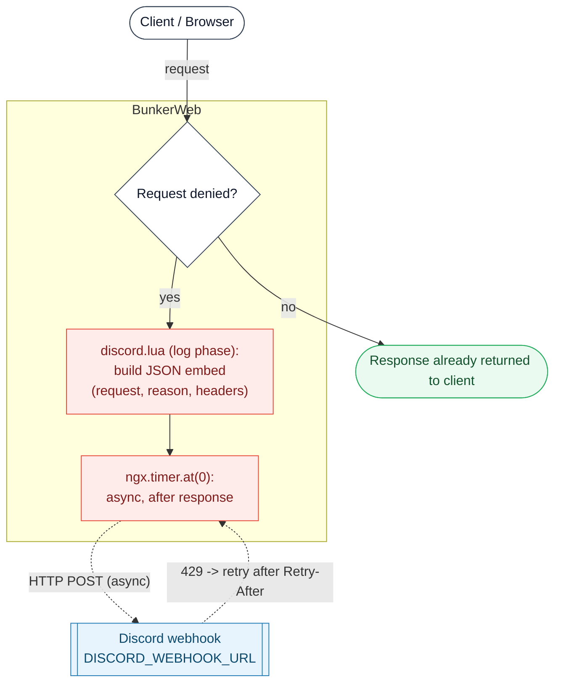

# Discord plugin




This [BunkerWeb](https://www.bunkerweb.io/?utm_campaign=self&utm_source=github)
plugin sends an attack notification to a Discord channel of your choice through
a webhook. It is a notifier only: it never blocks, delays, or alters traffic -
the decision to deny a request is made entirely by BunkerWeb's other security
features, and this plugin merely reports on it.

The handler runs on BunkerWeb's `log` phase, after the response has been
returned to the client. It only fires for requests that another plugin has
already denied (it reads the denial reason from BunkerWeb's request context and
returns immediately when there is none). The webhook `POST` itself is dispatched
from an `ngx.timer.at(0, ...)` callback, so it happens off the request path and
adds no latency to the client.

# Table of contents

- [Discord plugin](#discord-plugin)
- [Table of contents](#table-of-contents)
- [How it works](#how-it-works)
- [Prerequisites](#prerequisites)
- [Setup](#setup)
  - [Docker](#docker)
  - [Swarm](#swarm)
  - [Kubernetes](#kubernetes)
- [Settings](#settings)
- [Troubleshooting](#troubleshooting)
- [Notes](#notes)

# How it works

For each request BunkerWeb serves:

1. The `log` phase runs `discord.lua`. If `USE_DISCORD` is not `yes` for the
   matched site, the plugin returns immediately and does nothing. (A companion
   `log_default` hook covers the default server when it is disabled via
   `DISABLE_DEFAULT_SERVER`.)
2. The plugin reads the denial reason from BunkerWeb's request context. If the
   request was **not** denied by any security feature, it stops here - allowed
   traffic never produces a notification.
3. For a denied request, it builds a Discord embed describing the event: the
   request line, the denial reason and reason data, and the request headers.
   Embed field values are truncated to Discord's 1024-character limit. When the
   request carries many headers, they are folded into a code block in the embed
   description instead of one field each. Sensitive headers (`Authorization`,
   `Cookie`, `X-Api-Key`, ...) are redacted before the payload is built.
4. The HTTP `POST` to `DISCORD_WEBHOOK_URL` is scheduled with
   `ngx.timer.at(0, ...)`, so it is sent asynchronously after the response has
   already gone back to the client. The request's latency is unaffected.
5. If Discord replies `429 Too Many Requests` and `DISCORD_RETRY_IF_LIMITED` is
   `yes`, the timer is rescheduled using the `Retry-After` delay returned by
   Discord. Otherwise the `429` (or any non-2xx status) is logged and the
   notification is dropped. Webhook failures only ever touch the logs; they
   never affect the client.

# Prerequisites

Please read the [plugins section](https://docs.bunkerweb.io/latest/plugins/?utm_campaign=self&utm_source=github)
of the BunkerWeb documentation first.

You will need a Discord webhook URL for the target channel - see Discord's
[Intro to Webhooks](https://support.discord.com/hc/en-us/articles/228383668-Intro-to-Webhooks)
for how to create one.

# Setup

See the [plugins section](https://docs.bunkerweb.io/latest/plugins/?utm_campaign=self&utm_source=github)
of the BunkerWeb documentation for the installation procedure depending on your
integration. There is no extra service to deploy beyond the plugin itself.

## Docker

```yaml
services:
  bw-scheduler:
    image: bunkerity/bunkerweb-scheduler:1.6.11
    ...
    environment:
      USE_DISCORD: "yes"
      DISCORD_WEBHOOK_URL: "https://discordapp.com/api/webhooks/..."
```

## Swarm

```yaml
services:
  bw-scheduler:
    image: bunkerity/bunkerweb-scheduler:1.6.11
    ...
    environment:
      USE_DISCORD: "yes"
      DISCORD_WEBHOOK_URL: "https://discordapp.com/api/webhooks/..."
    networks:
      - bw-plugins
    ...

networks:
  bw-plugins:
    driver: overlay
    attachable: true
    name: bw-plugins
```

## Kubernetes

```yaml
apiVersion: networking.k8s.io/v1
kind: Ingress
metadata:
  name: ingress
  annotations:
    bunkerweb.io/USE_DISCORD: "yes"
    bunkerweb.io/DISCORD_WEBHOOK_URL: "https://discordapp.com/api/webhooks/..."
```

# Settings

| Setting                    | Default                                   | Context   | Multiple | Description                                                                                    |
| -------------------------- | ----------------------------------------- | --------- | -------- | ---------------------------------------------------------------------------------------------- |
| `USE_DISCORD`              | `no`                                      | multisite | no       | Enable sending alerts to a Discord channel.                                                    |
| `DISCORD_WEBHOOK_URL`      | `https://discordapp.com/api/webhooks/...` | global    | no       | Address of the Discord Webhook.                                                                |
| `DISCORD_RETRY_IF_LIMITED` | `no`                                      | global    | no       | Retry to send the request if Discord API is rate limiting us (may consume a lot of resources). |

# Troubleshooting

- **No notifications arrive.** Confirm `USE_DISCORD=yes` is set for the site and
  that `DISCORD_WEBHOOK_URL` is a valid, reachable webhook. Remember that only
  **denied** requests notify - if nothing is being blocked, nothing is sent.
- **Test connectivity end to end.** Send a `POST` to `/discord/ping` through
  BunkerWeb. The plugin's API hook posts a test embed to the configured webhook
  and returns the upstream result, so you can confirm the webhook works without
  waiting for a real attack.
- **Notifications stop under heavy load.** When Discord rate-limits the webhook
  (`429`), notifications are dropped unless `DISCORD_RETRY_IF_LIMITED=yes`.
  Enabling retries makes the plugin honor the `Retry-After` delay, at the cost
  of more scheduled timers.
- **Webhook errors in the scheduler logs.** Any non-2xx response from Discord is
  logged and the notification is discarded. This is by design and never affects
  the client; check the logged status code and the webhook URL.

# Notes

- **Only denied requests are reported.** This plugin never blocks legitimate
  traffic; it reacts to denials made by BunkerWeb's other security features.
- **Zero added latency.** The webhook `POST` runs from an asynchronous
  `ngx.timer` after the response is sent, so notification delivery never slows
  down the client request.
- **Sensitive headers are redacted.** Credential-bearing headers
  (`Authorization`, `Proxy-Authorization`, `Cookie`, `Set-Cookie`, `X-Api-Key`,
  `X-Csrf-Token`, `X-Auth-Token`, `X-Access-Token`, ...) are replaced with
  `[REDACTED]` before the payload leaves BunkerWeb, so secrets are not forwarded
  to Discord.
