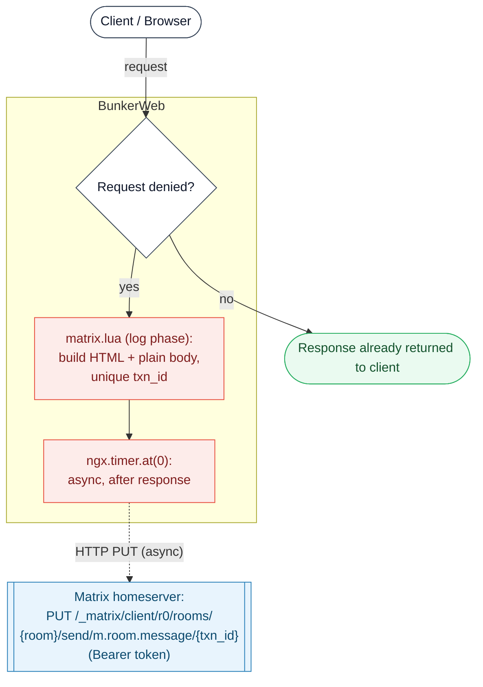

# Matrix Notification Plugin




This [BunkerWeb](https://www.bunkerweb.io/?utm_campaign=self&utm_source=github)
plugin sends an attack notification to a Matrix room every time BunkerWeb denies
a request. It runs entirely on BunkerWeb's **log phase** (`log` / `log_default`
hooks), so it fires after the verdict has already been reached: it only reports,
it **never blocks or delays traffic**. Requests that are allowed produce no
notification.

When a request is denied, `matrix.lua` builds an HTML-formatted and a plain-text
message describing the request - method, client IP, GeoIP country, ASN and AS
organization, the target host and URI, and the deny reason - then schedules an
async `ngx.timer.at(0)` callback that issues an HTTP `PUT` to the Matrix
client-server API once the response has already been returned. Each message
carries a unique transaction id, so the send is idempotent: Matrix silently
drops duplicate transaction ids, and a retried message is never double-posted.

# Table of contents

- [Matrix Notification Plugin](#matrix-notification-plugin)
- [Table of contents](#table-of-contents)
- [How it works](#how-it-works)
- [Prerequisites](#prerequisites)
- [Setup](#setup)
  - [Docker](#docker)
  - [Swarm](#swarm)
  - [Kubernetes](#kubernetes)
- [Settings](#settings)
- [Troubleshooting](#troubleshooting)
- [Notes](#notes)

# How it works

1. A client request reaches BunkerWeb and goes through all of BunkerWeb's
   normal checks. The Matrix plugin does not participate in this decision.
2. If the request is **allowed**, the response is returned to the client and
   nothing else happens - no message is sent.
3. If the request is **denied**, `matrix.lua` runs on the log phase. It reads the
   deny reason, then enriches the event with the client IP's GeoIP country, ASN
   and AS organization (each falls back to an `... unknown` label if the lookup
   fails). It assembles two payloads: an `org.matrix.custom.html`
   `formatted_body` and a plain-text `body`. All user-controlled values (IP,
   host, URI, reason, header names and values) are HTML-escaped.
4. If `MATRIX_INCLUDE_HEADERS=yes`, the request headers are appended as a table;
   credential-bearing headers (`Authorization`, `Cookie`, `X-Api-Key`, ...) are
   replaced with `[REDACTED]`. If `MATRIX_ANONYMIZE_IP=yes`, the client IP is
   masked in both payloads before sending.
5. The handler schedules `ngx.timer.at(0, ...)` and returns immediately, so the
   client's response is not delayed by the network round-trip to Matrix.
6. The async callback sends an HTTP `PUT` to
   `<MATRIX_BASE_URL>/_matrix/client/r0/rooms/<room_id>/send/m.room.message/<txn_id>`
   with an `Authorization: Bearer <MATRIX_ACCESS_TOKEN>` header. The room id is
   percent-encoded into the path, and `<txn_id>` is a unique
   `milliseconds_pid_counter` value to guarantee idempotency.
7. The plugin also exposes an internal `POST /matrix/ping` API endpoint (used by
   the BunkerWeb web UI's test button), which sends a plain-text
   `Test message from bunkerweb.` to the configured room to validate the
   credentials and membership. When the default server is disabled
   (`DISABLE_DEFAULT_SERVER=yes`), the `log_default` hook reports denials hitting
   the default server as well.

# Prerequisites

Please read the [plugins section](https://docs.bunkerweb.io/latest/plugins/?utm_campaign=self&utm_source=github)
of the BunkerWeb documentation first.

You will need:

- A Matrix homeserver base URL (e.g. `https://matrix.org`).
- A valid **access token** for the Matrix user the notifications are sent from
  (an access token, not the account password).
- The internal **room id** (`!id:server` form, e.g. `!abcdefg:matrix.org`) of the
  room to post into. The sending user must already be a **member** of that room.

Refer to your homeserver's documentation if you need help obtaining these.

# Setup

See the [plugins section](https://docs.bunkerweb.io/latest/plugins/?utm_campaign=self&utm_source=github)
of the BunkerWeb documentation for the generic plugin installation procedure
(the short version: drop the `matrix/` directory into the scheduler's
`/data/plugins/` and restart). There is no additional service to deploy - the
plugin talks directly to your Matrix homeserver.

The Matrix settings are read by the scheduler, so set them on the
**bw-scheduler** service.

## Docker

```yaml
services:

  bunkerweb:
    image: bunkerity/bunkerweb:1.6.11
    ...

  bw-scheduler:
    image: bunkerity/bunkerweb-scheduler:1.6.11
    ...
    environment:
      USE_MATRIX: "yes"
      MATRIX_BASE_URL: "https://matrix.org"
      MATRIX_ROOM_ID: "!yourRoomID:matrix.org"
      MATRIX_ACCESS_TOKEN: "your-access-token"
```

## Swarm

```yaml
services:

  bunkerweb:
    image: bunkerity/bunkerweb:1.6.11
    ...

  bw-scheduler:
    image: bunkerity/bunkerweb-scheduler:1.6.11
    ...
    environment:
      USE_MATRIX: "yes"
      MATRIX_BASE_URL: "https://matrix.org"
      MATRIX_ROOM_ID: "!yourRoomID:matrix.org"
      MATRIX_ACCESS_TOKEN: "your-access-token"
    deploy:
      mode: replicated
      replicas: 1
```

## Kubernetes

`USE_MATRIX` is a multisite setting (it can be enabled per service via Ingress
annotations), but `MATRIX_BASE_URL`, `MATRIX_ROOM_ID` and `MATRIX_ACCESS_TOKEN`
are **global** settings - set them as environment variables on the scheduler
Deployment:

```yaml
apiVersion: apps/v1
kind: Deployment
metadata:
  name: bunkerweb-scheduler
spec:
  replicas: 1
  template:
    spec:
      containers:
        - name: bunkerweb-scheduler
          image: bunkerity/bunkerweb-scheduler:1.6.11
          env:
            - name: USE_MATRIX
              value: "yes"
            - name: MATRIX_BASE_URL
              value: "https://matrix.org"
            - name: MATRIX_ROOM_ID
              value: "!yourRoomID:matrix.org"
            - name: MATRIX_ACCESS_TOKEN
              value: "your-access-token"
```

# Settings

| Setting                  | Default                  | Context   | Multiple | Description                                               |
| ------------------------ | ------------------------ | --------- | -------- | --------------------------------------------------------- |
| `USE_MATRIX`             | `no`                     | multisite | no       | Enable sending alerts to a Matrix room.                   |
| `MATRIX_BASE_URL`        | `https://matrix.org`     | global    | no       | Base URL of the Matrix server (e.g., https://matrix.org). |
| `MATRIX_ROOM_ID`         | `!yourRoomID:matrix.org` | global    | no       | Room ID of the Matrix room to send notifications to.      |
| `MATRIX_ACCESS_TOKEN`    |                          | global    | no       | Access token to authenticate with the Matrix server.      |
| `MATRIX_ANONYMIZE_IP`    | `no`                     | global    | no       | Mask the IP address in notifications.                     |
| `MATRIX_INCLUDE_HEADERS` | `no`                     | global    | no       | Include request headers in notifications.                 |

# Troubleshooting

- **No message arrives, scheduler log shows `request returned status 401`.**
  `MATRIX_ACCESS_TOKEN` is wrong or expired. It must be an **access token**, not
  the account password (in Element: _Settings → Help & About → Access Token_, or
  obtain one via the login API).
- **`request returned status 403` (`M_FORBIDDEN`).** The sending user is not a
  member of the target room. Join the room with that user first; the homeserver
  rejects sends from non-members.
- **Message goes nowhere / wrong room.** `MATRIX_ROOM_ID` must be the internal
  `!id:server` form (e.g. `!abcdefg:matrix.org`), not the human-readable alias
  `#room:server`. Resolve the alias to its internal id and use that.
- **Nothing is ever sent, even under attack.** Only **denied** requests trigger a
  notification - the plugin reports on the log phase and never blocks. Confirm
  the request was actually denied by another BunkerWeb feature; an allowed
  (`200`) request will not produce a message by design.
- **`can't get Country/ASN/Organization of IP ...` in the logs.** The GeoIP/ASN
  MMDB databases are not loaded. The notification is still sent, with the
  affected field shown as `Country unknown` / `ASN unknown` /
  `AS Organization unknown`.
- **Verify the configuration end to end.** Use the web UI's Matrix test/ping
  action (internally `POST /matrix/ping`) - it sends a
  `Test message from bunkerweb.` to the room and surfaces a non-`2xx` Matrix
  response as an error.

# Notes

- **Reporting only, never blocking.** This plugin runs on the log phase. It does
  not deny, delay, or otherwise alter requests - it only reports requests that
  BunkerWeb has already denied. It does not affect request latency: the actual
  HTTP `PUT` to Matrix happens in an `ngx.timer.at(0)` callback after the
  response has been returned to the client.
- **Idempotent sends.** Every message uses a unique transaction id
  (`milliseconds_pid_counter`). Matrix drops duplicate transaction ids, so a
  retried or replayed send is never posted twice.
- **Sensitive data handling.** All user-controlled content placed in the message
  is HTML-escaped to keep attacker-supplied values from breaking the Matrix HTML
  markup. When `MATRIX_INCLUDE_HEADERS=yes`, credential-bearing request headers
  (`Authorization`, `Proxy-Authorization`, `Cookie`, `Set-Cookie`, `X-Api-Key`,
  `X-Csrf-Token`, `X-Auth-Token`, ...) are replaced with `[REDACTED]` before the
  payload leaves the instance.
- **IP anonymization.** With `MATRIX_ANONYMIZE_IP=yes`, the client IP is masked
  before sending: for IPv4 the last two octets become `xxx.xxx` (the first two
  octets are kept), and for IPv6 the first three groups are kept and the
  remainder is replaced with `:xxxx`.
- **Stream support.** The plugin supports stream (TCP/UDP) servers as well as
  HTTP servers.
