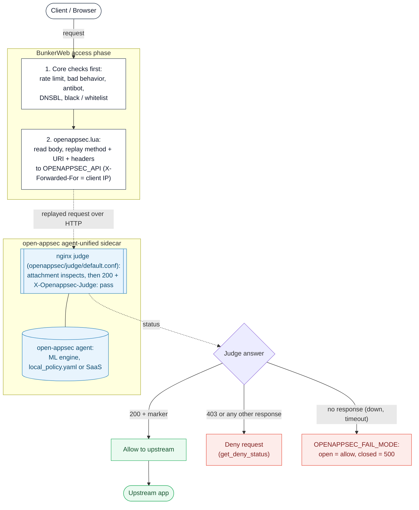

# open-appsec plugin




This [plugin](https://www.bunkerweb.io/latest/plugins/?utm_campaign=self&utm_source=github)
lets BunkerWeb consult [open-appsec](https://www.openappsec.io/), Check Point's
open-source, machine-learning web application firewall, before a request
reaches the upstream. open-appsec has no HTTP API: its attachments (an NGINX
module, an Envoy filter, a Kong Lua plugin) talk to the agent over shared
memory. This plugin therefore uses open-appsec's own **`agent-unified`**
container - agent, NGINX and attachment in one image - as a stateless
**judge sidecar**: BunkerWeb replays each request to it over HTTP, the
attachment inspects the replay, and the answer is the verdict.

The inspection runs from Lua during BunkerWeb's access phase, so all of
BunkerWeb's built-in checks (rate limit, bad behavior, antibot, DNSBL,
whitelist / blacklist, ...) run _before_ the request is handed to
open-appsec. Only the request side is inspected; open-appsec's response-side
features (response inspection, anti-bot script injection, custom block pages)
are not available through this plugin.

# Table of contents

- [open-appsec plugin](#open-appsec-plugin)
- [Table of contents](#table-of-contents)
- [How it works](#how-it-works)
- [Prerequisites](#prerequisites)
- [Setup](#setup)
  - [Docker / Swarm](#docker--swarm)
  - [Kubernetes / Helm](#kubernetes--helm)
  - [open-appsec policy](#open-appsec-policy)
  - [Tuning](#tuning)
- [What the web UI shows](#what-the-web-ui-shows)
- [Settings](#settings)
- [Troubleshooting](#troubleshooting)
- [Notes](#notes)

# How it works

1. BunkerWeb's access-phase checks run (rate limit, bad behavior, antibot,
   DNSBL, blacklist, ...). If any of them deny, the request stops here and
   open-appsec is never consulted.
2. Once per BunkerWeb instance at startup, `init_worker` sends a plain
   `GET <OPENAPPSEC_API>/` as a health check and logs the result. There is
   no dedicated ping path on purpose: BunkerWeb replays the client's URI
   verbatim, so any path the judge answered without inspection would be a
   path a client could use to skip the WAF.
3. On each request, `openappsec.lua` reads the request body and replays the
   request to the sidecar: same method, same URI and query string, same
   headers (minus the framing headers `Content-Length`, `Transfer-Encoding`,
   `Connection` and `Expect`, which lua-resty-http recomputes), same body.
   `Host` is kept, the client IP is passed in `X-Forwarded-For`, and
   `X-Request-ID` is set to BunkerWeb's own request id (any client-supplied
   value is overwritten) so an open-appsec event and a BunkerWeb report can be
   matched in either direction.
4. Inside the sidecar, NGINX runs the judge configuration shipped in
   `openappsec/judge/default.conf`: the `realip` module takes the client IP
   from `X-Forwarded-For` (so open-appsec logs and learns per real source),
   the open-appsec attachment inspects headers and body, and the request is
   then proxied to a tiny `http-echo` upstream that always answers `200`.
   The judge adds the header `X-Openappsec-Judge: pass` to that answer.
5. Back in BunkerWeb, `openappsec_helpers.verdict()` decides: `200` **with**
   the marker header is an accept; any other `2xx`/`3xx`/`4xx` answer
   (open-appsec's `403`, a redirect, a custom response code, a `200` without
   the marker) is a deny, with BunkerWeb's own deny status and reporting
   (`utils.get_deny_status()`); a `5xx` (the judge lost its echo upstream, a
   broken judge configuration) or no answer at all (connection refused,
   timeout) is an error.
6. On error, `OPENAPPSEC_FAIL_MODE` decides: `open` (default) logs the error
   and lets the request through; `closed` answers HTTP `500` instead.
7. Every `OPENAPPSEC_CANARY_INTERVAL` seconds (default 60), one worker per
   BunkerWeb instance sends a known-bad request (`GET /?id=/etc/passwd` for
   the host `canary.openappsec.bunkerweb.invalid`) to the judge and records the
   answer: `enforcing` (the judge blocked it), `not_enforcing` (the judge
   accepted it, so the attachment is not inspecting) or `down`. The plugin page
   shows the state; with `OPENAPPSEC_CANARY_FAIL: "yes"` a `not_enforcing`
   judge is treated like an unreachable one and `OPENAPPSEC_FAIL_MODE` applies.

# Prerequisites

Two extra containers, both from upstream images, reachable from BunkerWeb on
a shared network:

- **`ghcr.io/openappsec/agent-unified`** - the judge. It needs the plugin's
  `judge/default.conf` mounted at `/etc/nginx/conf.d/default.conf`, and either
  a local `local_policy.yaml` mounted under `/ext/appsec` (standalone,
  declarative mode) or an `AGENT_TOKEN` from the open-appsec SaaS management
  portal. The judge listens on port `80`, so hostnames in the policy's
  `specific-rules` match without a port suffix (open-appsec only matches
  host rules on ports 80 and 443 unless the rule names the port).
- **`hashicorp/http-echo`** - the always-`200` upstream the judge proxies to.
  It must be named `bw-openappsec-echo` (the judge configuration proxies to
  `http://bw-openappsec-echo:5678`), or edit the `set $echo` line. The judge
  resolves that name through Docker's embedded DNS (`resolver 127.0.0.11`),
  so the echo container can be restarted without restarting the judge;
  outside Docker, change the `resolver` line too.

The attachment only inspects a body that NGINX actually reads, which is why
the judge proxies instead of answering with a bare `return 200`. Proxying
back into the same NGINX was tried and lost enforcement after a couple of
minutes, hence the separate echo container.

# Setup

See the [plugins section](https://docs.bunkerweb.io/latest/plugins/?utm_campaign=self&utm_source=github)
of the BunkerWeb documentation for the generic plugin installation procedure
(the short version: drop the `openappsec/` directory into the scheduler's
`/data/plugins/` and restart).

## Docker / Swarm

`OPENAPPSEC_API` is the URL BunkerWeb uses to reach the judge - typically an
internal Docker network address. Turn the core ModSecurity WAF off so you do
not run two WAFs on every request.

```yaml
services:

  bunkerweb:
    image: bunkerity/bunkerweb:1.6.15
    ...
    networks:
      - bw-services
      - bw-plugins
    ...

  bw-scheduler:
    image: bunkerity/bunkerweb-scheduler:1.6.15
    ...
    volumes:
      - ./bw-data/plugins:/data/plugins # contains openappsec/
    environment:
      SERVER_NAME: "app.example.com"
      USE_REVERSE_PROXY: "yes"
      REVERSE_PROXY_HOST: "http://app:3000"
      REVERSE_PROXY_URL: "/"

      USE_MODSECURITY: "no" # Run open-appsec instead of the core ModSecurity WAF
      USE_OPENAPPSEC: "yes"
      OPENAPPSEC_API: "http://bw-openappsec"
      OPENAPPSEC_FAIL_MODE: "open" # or "closed" to deny when the judge is down

  bw-ui:
    image: bunkerity/bunkerweb-ui:1.6.15
    ...
    volumes:
      # Optional, for the web UI actions (events, exceptions, per-service mode):
      - ./appsec-logs:/var/log/openappsec:ro          # OPENAPPSEC_EVENTS_DIR
      - ./appsec-localconfig:/etc/openappsec          # OPENAPPSEC_POLICY_PATH (writable by uid 101)

  bw-openappsec:
    image: ghcr.io/openappsec/agent-unified:1.1.36
    command: /cp-nano-agent
    depends_on:
      - bw-openappsec-echo
    environment:
      - autoPolicyLoad=true          # reload local_policy.yaml when it changes
      - registered_server=NGINX
      - user_email=you@example.com   # optional, used by the open-appsec team for support
      # - AGENT_TOKEN=...            # SaaS management instead of local_policy.yaml
    volumes:
      - ./bw-data/plugins/openappsec/judge/default.conf:/etc/nginx/conf.d/default.conf:ro
      - ./appsec-localconfig:/ext/appsec      # contains local_policy.yaml (shared with bw-ui)
      - ./appsec-config:/etc/cp/conf          # persistence (recommended)
      - ./appsec-data:/etc/cp/data
      - ./appsec-logs:/var/log/nano_agent     # events, shared read-only with bw-ui
    healthcheck:
      # The judge's nginx answers 200 for everything until the attachment registers with the
      # agent, and keeps answering (or stops answering) if the agent's transaction handler
      # dies: only a known-bad request coming back 403 proves it is enforcing.
      test: ["CMD-SHELL", "curl -s -o /dev/null -w '%{http_code}' -H 'Host: healthcheck.invalid' 'http://127.0.0.1/?id=/etc/passwd' | grep -q 403"]
      interval: 30s
      timeout: 5s
      start_period: 90s
      retries: 3
    networks:
      - bw-plugins

  bw-openappsec-echo:
    image: hashicorp/http-echo:1.0.0
    command: ["-text=ok"]
    networks:
      - bw-plugins

networks:
  bw-services:
    name: bw-services
  bw-plugins:
    name: bw-plugins
```

The judge's NGINX answers as soon as the container starts, but the open-appsec
attachment only registers with the agent about 20 seconds later and **fails
open until then**: during that window the judge returns `200` for everything.
The same happens if the agent's transaction handler dies while NGINX keeps
running. The `healthcheck` above sends a known-bad request and expects `403`,
the only answer that proves enforcement; the plugin page's status card turns
red as soon as the judge stops answering. Docker marks the container
`unhealthy` but does not restart it on its own: pair it with a restart policy
and an auto-heal mechanism (or an orchestrator that acts on health) if you
want automatic recovery. The plugin's own canary (see
[How it works](#how-it-works)) watches the same thing from the BunkerWeb side.

The two shared directories need the right permissions once:
`mkdir -p appsec-logs appsec-localconfig && chown 101:101 appsec-localconfig`
(the web UI runs as uid `101` and writes the policy; the agent creates the
event files world-readable, so `appsec-logs` only needs to exist).

## Kubernetes / Helm

The judge is a separate Deployment and Service; BunkerWeb reaches it through
`OPENAPPSEC_API: "http://bw-openappsec"` (a ClusterIP Service on port 80 in
the same namespace). The pieces:

- **ConfigMap `openappsec-judge`** with `default.conf` (this plugin's
  `judge/default.conf`, `resolver` changed to the cluster DNS, e.g.
  `resolver kube-dns.kube-system.svc.cluster.local valid=10s;`, and
  `set $echo bw-openappsec-echo.<namespace>.svc.cluster.local;`) and
  `local_policy.yaml`.
- **Deployment `bw-openappsec`** running `ghcr.io/openappsec/agent-unified`
  with `command: ["/cp-nano-agent"]`, env `autoPolicyLoad=true`,
  `registered_server=NGINX`, the ConfigMap mounted at
  `/etc/nginx/conf.d/default.conf` (`subPath`) and `/ext/appsec/local_policy.yaml`
  (`subPath`), PVCs for `/etc/cp/conf` and `/etc/cp/data`, a `readinessProbe`
  that runs the same known-bad `curl ... | grep -q 403` as the compose
  healthcheck, and **Service `bw-openappsec`** on port 80.
- **Deployment + Service `bw-openappsec-echo`** (`hashicorp/http-echo`, port 5678).
- The plugin itself is mounted into the scheduler at `/data/plugins/openappsec`
  (a ConfigMap or an init container that clones this repository), exactly as
  for any other external plugin in the BunkerWeb Helm chart.

The web UI actions need the UI pod to see the judge's log directory and to
write the policy file. Pods do not share `emptyDir` volumes, so either run
the judge and its echo as **sidecar containers of the `bunkerweb-ui` pod**
(one `emptyDir` for `/var/log/nano_agent` ↔ `/var/log/openappsec`, one for
`/ext/appsec` ↔ `/etc/openappsec`, the `bw-openappsec` Service selecting that
pod) or back both paths with a `ReadWriteMany` PVC. Without a shared volume the
plugin page still shows the judge status, the canary and the recent denies;
only the events view, the exceptions and the per-service mode are disabled.
A policy edited from the UI is a plain file: with a ConfigMap-backed policy
the UI cannot write it, so mount a PVC (or the shared `emptyDir`) and seed it
from the ConfigMap with an init container instead.

## open-appsec policy

A minimal `appsec-localconfig/local_policy.yaml` that blocks in prevent mode
and answers a plain `403` (the plugin only needs the status, BunkerWeb serves
its own deny page). It is written in **JSON syntax**, which open-appsec
accepts (YAML is a superset of JSON) and which is the only form the web UI
can edit - the UI image ships no YAML parser. A hand-written YAML policy works
the same for the judge; the UI then shows it read-only.

```json
{
  "policies": {
    "default": {
      "mode": "prevent-learn",
      "practices": ["webapp-default-practice"],
      "triggers": ["appsec-default-log-trigger"],
      "custom-response": "appsec-default-web-user-response",
      "exceptions": []
    },
    "specific-rules": []
  },
  "practices": [
    {
      "name": "webapp-default-practice",
      "web-attacks": {
        "minimum-confidence": "critical",
        "override-mode": "as-top-level"
      }
    }
  ],
  "log-triggers": [
    {
      "name": "appsec-default-log-trigger",
      "appsec-logging": { "detect-events": true, "prevent-events": true },
      "extended-logging": { "http-headers": true }
    }
  ],
  "custom-responses": [
    {
      "name": "appsec-default-web-user-response",
      "mode": "response-code-only",
      "http-response-code": 403
    }
  ],
  "exceptions": []
}
```

`extended-logging.http-headers: true` makes each event carry the request
headers, including the `x-request-id` BunkerWeb adds, which is what links an
event to a BunkerWeb report. The agent re-reads the file about 20-40 seconds
after it changes (`autoPolicyLoad=true`); during the reload itself the judge
briefly answers `200` to everything (a few seconds, observed), so batch policy
edits rather than saving in a loop. `log-destination: file:` is not
implemented upstream: the events only exist in the agent's log directory
(`/var/log/nano_agent/cp-nano-http-transaction-handler.log*`), which is why
the web UI reads that directory.

The full schema (`detect-learn` to observe first, per-host `specific-rules`,
exceptions, Snort signatures, OpenAPI schema validation) is in the
[open-appsec documentation](https://docs.openappsec.io/getting-started/start-with-docker/configuration-using-local-policy-file-docker).
The complete example used by this plugin's e2e test is in
`.tests/openappsec/appsec-localconfig/local_policy.yaml`.

# What the web UI shows

The plugin page (`Plugins > open-appsec`) always shows, from BunkerWeb's own
data:

- the **judge status** (ping) and the **enforcement canary** (state, latency,
  last check), four counters (accepted, denied, skipped by the exclusions,
  judge errors that fell back to `OPENAPPSEC_FAIL_MODE`) and the **recent
  denies** table: date, client IP, service, method, URL, judge status,
  open-appsec event id and BunkerWeb request id;
- **Reports**: each block is a BunkerWeb report with reason `openappsec` and,
  in its details, `judge_status`, `event_id`, `request_id`, `judge` (the
  `OPENAPPSEC_API` used) and `reason`.

With the two shared volumes of the compose example mounted into `bw-ui`
(`OPENAPPSEC_EVENTS_DIR`, `OPENAPPSEC_POLICY_PATH`), the page also offers:

- **open-appsec events** read from the agent's log directory: time, source IP,
  host, method, action (`Prevent` / `Detect`), incident type, matched
  location, parameter and sample, confidence, request id and event id - the
  _why_ behind each block. Canary probes are filtered out. Each row has
  **Ban IP** (a BunkerWeb ban, global or for that service, 1 hour to 30 days,
  reason `open-appsec event <id>`) and **Add exception**, which pre-fills the
  exception form with the source IP and URL of that event.
- **Agent status**: agent version and id, last event, events / prevented /
  detected over the last 24 hours, top incident types.
- **Exceptions** (open-appsec `exceptions`, referenced from the default policy
  and every host rule): add one with an action (`skip`, `accept`, `drop`,
  `suppressLog`) and any of `sourceIp` (IP or CIDR), `url`, `hostName`,
  `paramName`, `paramValue`, `protectionName`, `countryCode`; remove one.
- **Mode per service**: the default policy mode and, for every server name
  BunkerWeb knows, an override (`prevent-learn`, `detect-learn`, `prevent`,
  `detect`, `inactive`, or _inherit_) written as an open-appsec
  `specific-rules` entry for that host.

Policy edits are written atomically (`local_policy.yaml.tmp` then rename,
previous version kept as `local_policy.yaml.bak`) and picked up by the agent
within about 20-40 seconds. A policy that is not in JSON syntax is shown
read-only with the reason. The event id is the `X-Event-ID` header open-appsec
puts on its block response, the same value it logs as `eventReferenceId`.

## Tuning

- **Timeouts.** `OPENAPPSEC_CONNECT_TIMEOUT` (default 1 s) bounds the TCP
  connect, `OPENAPPSEC_READ_TIMEOUT` (default 5 s) bounds sending the replay
  and reading the verdict. A judge that is down usually fails the connect, so
  the request stalls for the connect timeout only.
- **Error cooldown.** With `OPENAPPSEC_ERROR_COOLDOWN` (seconds, default 0),
  a worker that just got an error from the judge stops calling it for that
  long and applies `OPENAPPSEC_FAIL_MODE` immediately, instead of paying a
  timeout on every request while the judge is down. Each nginx worker keeps
  its own cooldown; the first request per worker after the deadline probes
  the judge again.
- **Body replay.** `OPENAPPSEC_INSPECT_BODY: "no"` replays headers, URI and
  query string only; `OPENAPPSEC_MAX_BODY_SIZE` (bytes, `0` = unlimited)
  keeps body inspection but skips it for uploads above the limit. Both are
  per service. A skipped body is logged at `notice` level.
- **Exclusions.** `OPENAPPSEC_EXCLUDED_URIS` (space-separated PCRE regexes,
  matched against the path without the query string) and
  `OPENAPPSEC_EXCLUDED_METHODS` (e.g. `OPTIONS HEAD`) skip the judge entirely
  for health checks, webhooks with signed bodies, CORS preflights. Skipped
  requests are counted on the plugin page but never reported.
- **Header privacy.** `OPENAPPSEC_STRIP_HEADERS` (e.g. `authorization cookie`)
  removes those request headers from the copy sent to the judge. open-appsec
  then cannot inspect them, so only strip what compliance requires.
- **Canary.** `OPENAPPSEC_CANARY_INTERVAL` (seconds, default 60, `0` disables)
  paces the known-bad probe. Each probe is one request to the judge and one
  `Prevent` event in the agent's log for the host
  `canary.openappsec.bunkerweb.invalid` (the UI hides those). Per service,
  `OPENAPPSEC_CANARY_FAIL: "yes"` turns a `not_enforcing` verdict into a judge
  error, so a judge whose attachment silently stopped inspecting no longer
  lets traffic through unscanned when the site runs
  `OPENAPPSEC_FAIL_MODE: "closed"`. The default keeps it advisory (status card
  and log only).
  A policy in `detect-learn` or `detect` mode (open-appsec's own default) lets
  the probe through by design, so the canary reports `not_enforcing` for as
  long as that mode is active: leave `OPENAPPSEC_CANARY_FAIL` at `no` while
  the model learns, or the site fails closed. The canary record expires after
  three intervals, so a stopped canary (interval `0`) never pins a stale
  verdict.

# Settings

| Setting                       | Default                             | Context   | Multiple | Description                                                                                                                                                                                     |
| ----------------------------- | ----------------------------------- | --------- | -------- | ----------------------------------------------------------------------------------------------------------------------------------------------------------------------------------------------- |
| `USE_OPENAPPSEC`              | `no`                                | multisite | no       | Activate open-appsec request inspection for this site.                                                                                                                                          |
| `OPENAPPSEC_API`              | `http://bw-openappsec`              | global    | no       | Base URL (scheme + host[:port]) of the open-appsec judge sidecar, e.g. http://bw-openappsec. The judge listens on port 80 so open-appsec host rules match without a port suffix.                |
| `OPENAPPSEC_FAIL_MODE`        | `open`                              | multisite | no       | Choose whether requests are allowed or denied when the open-appsec judge is unreachable.                                                                                                        |
| `OPENAPPSEC_CONNECT_TIMEOUT`  | `1000`                              | global    | no       | Milliseconds to wait for a TCP connection to the judge before giving up (then OPENAPPSEC_FAIL_MODE applies).                                                                                    |
| `OPENAPPSEC_READ_TIMEOUT`     | `5000`                              | global    | no       | Milliseconds to wait for the judge's verdict once connected; covers sending the replay and reading the answer.                                                                                  |
| `OPENAPPSEC_ERROR_COOLDOWN`   | `0`                                 | global    | no       | Seconds during which a worker skips the judge after an error (fail mode applied immediately, no timeout per request). 0 disables the cooldown.                                                  |
| `OPENAPPSEC_INSPECT_BODY`     | `yes`                               | multisite | no       | Replay the request body to the judge. Set to no to inspect headers, URI and query string only.                                                                                                  |
| `OPENAPPSEC_MAX_BODY_SIZE`    | `0`                                 | multisite | no       | Bodies larger than this many bytes are not replayed (headers only). 0 means no limit.                                                                                                           |
| `OPENAPPSEC_EXCLUDED_URIS`    |                                     | multisite | no       | Space-separated PCRE regexes matched against the request path (no query string); matching requests skip open-appsec, e.g. ^/healthz$ ^/webhooks/.                                               |
| `OPENAPPSEC_EXCLUDED_METHODS` |                                     | multisite | no       | Space-separated HTTP methods that skip open-appsec, e.g. OPTIONS HEAD.                                                                                                                          |
| `OPENAPPSEC_STRIP_HEADERS`    |                                     | multisite | no       | Space-separated request header names removed from the copy sent to the judge, e.g. authorization cookie. Privacy at the cost of detection on those headers.                                     |
| `OPENAPPSEC_CANARY_INTERVAL`  | `60`                                | global    | no       | Seconds between enforcement canaries: a known-bad request sent to the judge to prove it still blocks. 0 disables the canary.                                                                    |
| `OPENAPPSEC_CANARY_FAIL`      | `no`                                | multisite | no       | When the canary reports that the judge is no longer enforcing (it accepted a known-bad request), treat every request as a judge error so OPENAPPSEC_FAIL_MODE applies.                          |
| `OPENAPPSEC_EVENTS_DIR`       | `/var/log/openappsec`               | global    | no       | Directory inside the web UI container where the judge's agent log directory (/var/log/nano_agent) is mounted read-only. Feeds the open-appsec events view. Empty disables it.                   |
| `OPENAPPSEC_POLICY_PATH`      | `/etc/openappsec/local_policy.yaml` | global    | no       | Path inside the web UI container of the judge's local_policy.yaml (shared volume, writable by the UI, JSON syntax). Enables exceptions and per-service mode from the web UI. Empty disables it. |

# Troubleshooting

- **Every request passes, nothing is ever blocked.** Check the scheduler log
  for `open-appsec unreachable, failing open`: the judge is down, not on the
  shared network, or `OPENAPPSEC_API` is wrong. Also make sure the policy is
  in `prevent-learn` (or `prevent`) mode - `detect-learn` logs and never
  blocks - and that the judge got the plugin's `default.conf` (a stock
  `agent-unified` answers with its own default site, which carries no marker
  and would deny everything instead).
- **Every request is denied.** The judge answers, but without the
  `X-Openappsec-Judge: pass` marker or with a non-`200` status: the judge
  configuration is not mounted (the deny reason then reads
  `status 200 without judge marker`), or the policy uses a custom response
  the plugin treats as a block. `docker compose logs bw-openappsec` shows the
  NGINX side. A missing echo container is a `502`, which is an _error_, so it
  follows `OPENAPPSEC_FAIL_MODE` instead.
- **Every request returns HTTP 500.** `OPENAPPSEC_FAIL_MODE` is `closed` and
  the judge is unreachable.
- **Attacks pass during the first seconds after a judge restart.** Expected:
  the attachment registers with the agent about 20 seconds after NGINX starts
  and the judge fails open until then. The canary reports `not_enforcing`
  during that window; keep the judge running (`restart: unless-stopped`), do
  not recreate it on every deploy, and set `OPENAPPSEC_CANARY_FAIL: "yes"` on
  the services where unscanned traffic is worse than a short outage.
- **Canary says `not_enforcing` for good.** The judge answers `200` with the
  marker to a known-bad request: the attachment is not inspecting (agent not
  registered, transaction handler dead, policy in `detect-learn` or
  `inactive` mode, or the canary host caught by an exception). Check
  `docker compose logs bw-openappsec` and the policy mode.
- **The plugin page shows no events / the policy is read-only.** The shared
  volumes are not mounted into `bw-ui` at the paths in `OPENAPPSEC_EVENTS_DIR`
  and `OPENAPPSEC_POLICY_PATH`, the policy directory is not writable by uid
  `101`, or the policy is hand-written YAML (only JSON syntax can be edited;
  the page says which).
- **Status card says the judge is down but the container is "Up".** The
  agent's transaction handler or the NGINX master died inside `agent-unified`
  and the orphaned workers answer nothing (seen after an interrupted
  `docker compose stop`). Every request is then failing open. Recreate the
  container (`docker compose up -d --force-recreate bw-openappsec`); the
  `healthcheck` in the compose example flags this state as `unhealthy`.
- **A legitimate request is blocked.** The plugin page's events table (or the
  agent's log directory) shows the matched location, parameter, sample and
  incident type behind the block. Tune with the policy: `minimum-confidence`,
  per-host `specific-rules`, exceptions, or `detect-learn` while the model
  learns - the last three straight from the plugin page.
- **Requests are inspected twice / unexpected WAF blocks.** You are likely
  running both open-appsec and the core ModSecurity WAF. Set
  `USE_MODSECURITY: "no"` so only open-appsec evaluates the request.

# Notes

- **Two sidecar containers, both upstream images.** Nothing is built or
  published by this repository for open-appsec: the judge is
  `ghcr.io/openappsec/agent-unified`, the upstream is `hashicorp/http-echo`.
  Pin the agent tag; `latest` moves.
- **Fail-open by default.** A judge that is down, restarting or timing out
  lets traffic through unscanned, with an error in the scheduler log. Set
  `OPENAPPSEC_FAIL_MODE: "closed"` to deny instead (HTTP `500`), at the cost of
  coupling availability to the sidecar.
- **Request side only.** BunkerWeb plugins have no response body filter, so
  open-appsec's response inspection, anti-bot injection and custom block
  pages do not apply. A block is served by BunkerWeb with its usual deny
  status and shows up in BunkerWeb's reports like any other deny.
- **The body is replayed in full.** Uploads are read by BunkerWeb
  (`MAX_CLIENT_SIZE` bounds them) and streamed to the judge; the judge's
  `client_max_body_size 0` leaves the limit to BunkerWeb. Large bodies add
  the round trip to the judge on top of open-appsec's own inspection time;
  raise `OPENAPPSEC_READ_TIMEOUT`, cap the replay with `OPENAPPSEC_MAX_BODY_SIZE`, or
  turn body replay off for that site with `OPENAPPSEC_INSPECT_BODY: "no"`.
- **The real client IP reaches open-appsec** through `X-Forwarded-For` and
  the judge's `realip` configuration, so per-source learning, reputation and
  the logged `sourceIP` are the client's, not BunkerWeb's.
- **Learning works per host.** open-appsec's model is keyed by the `Host`
  header, which the replay preserves, so the judge learns each protected
  service separately without further configuration.
