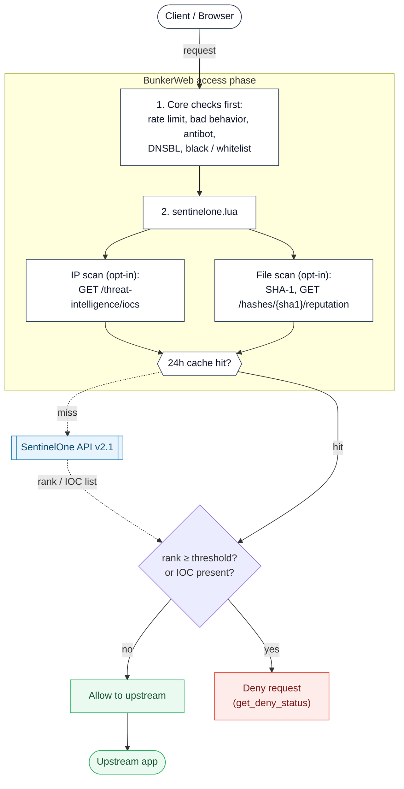

# SentinelOne plugin




This [BunkerWeb](https://www.bunkerweb.io/?utm_campaign=self&utm_source=github)
plugin checks incoming requests against your
[SentinelOne](https://www.sentinelone.com/) Singularity console using the
Management API v2.1 during BunkerWeb's access phase. When enabled, it can look up
the client's IP address in your threat-intelligence IOC database and the SHA-1 of
each file uploaded in a `multipart/form-data` request against SentinelOne hash
reputation, then deny the request when SentinelOne's verdict crosses the
configured threshold.

The check runs from Lua in the access phase, so all of BunkerWeb's built-in
checks (rate limit, bad behavior, antibot, DNSBL, whitelist / blacklist, ...)
run _before_ SentinelOne is queried — already-blocked clients never consume an
API call. IP and file lookups are cached for 24 hours (IP keyed by address, file
keyed by SHA-1), so repeated visitors and identical uploads do not re-query the
API.

# Table of contents

- [SentinelOne plugin](#sentinelone-plugin)
- [Table of contents](#table-of-contents)
- [How it works](#how-it-works)
- [Prerequisites](#prerequisites)
- [Setup](#setup)
  - [Docker](#docker)
  - [Swarm](#swarm)
  - [Kubernetes](#kubernetes)
- [Settings](#settings)
- [Troubleshooting](#troubleshooting)
- [Limitations](#limitations)

# How it works

For a request to `https://app.example.com/...`:

1. BunkerWeb's access-phase checks run first (rate limit, bad behavior,
   antibot, DNSBL, blacklist, ...). If any of them deny, the request stops
   before SentinelOne is contacted.
2. `sentinelone.lua` runs when `USE_SENTINELONE=yes` and at least one of
   `SENTINELONE_SCAN_IP` / `SENTINELONE_SCAN_FILE` is `yes`. At worker startup an
   `init_worker` pre-connect validates the API URL, the token and reachability
   against SentinelOne's `system/info` endpoint, so a misconfiguration is logged
   early rather than only surfacing on the first request. If
   `SENTINELONE_API_URL` or `SENTINELONE_API_TOKEN` is empty the plugin logs a
   warning and skips all checks (the request is allowed).
3. **IP scan** (when `SENTINELONE_SCAN_IP=yes` _and_ the client IP is global):
   the handler does a `GET` against `/threat-intelligence/iocs` with the IP in
   the `value` query argument (`type=ipv4` or `type=ipv6`). A non-empty result —
   the IP is present as an indicator of compromise in your tenant — denies the
   request. Private, loopback and other non-global addresses are skipped.
4. **File scan** (when `SENTINELONE_SCAN_FILE=yes` _and_ the request is
   `multipart/form-data`): each part that carries a filename is hashed with
   **SHA-1**, then looked up with a `GET` against `/hashes/<sha1>/reputation`.
   Parts without a filename (plain form fields) are ignored. Over **HTTP/1.x**
   the body is streamed with `resty.upload`; over **HTTP/2 / HTTP/3** — where the
   raw request socket `resty.upload` relies on is unavailable — the body is
   buffered (in memory, or nginx's temp file for large uploads) and its multipart
   parts are parsed before hashing. The IP scan never reads the body and works on
   every protocol.
5. Both paths first consult the 24-hour cache (IP keyed by address, file keyed
   by SHA-1). On a cache miss the SentinelOne API is queried and the result is
   stored for 24 hours.
6. **Verdict.** For a file, SentinelOne returns a reputation `rank` on a 1–10
   scale (higher = more malicious); `sentinelone_helpers.evaluate` denies when
   the rank is **greater than or equal to** `SENTINELONE_FILE_RANK`. For an IP,
   any matching IOC denies. A `404` (the hash is unknown to SentinelOne) is
   treated as clean. Over-threshold or IOC-present requests are denied with
   BunkerWeb's deny status; everything else continues to the upstream.

On any other API error — a non-`200`, non-`404` response such as a `401` from a
bad token, a `429` rate limit, a `5xx`, a timeout or an unparsable body — the
plugin **fails open**: it logs the error and lets the request continue to the
upstream rather than denying it or returning a server error. Connectivity
problems therefore never take your site down; they only weaken scanning until
they are fixed.

The plugin also exposes an internal `POST /sentinelone/ping` API endpoint, used
by the BunkerWeb web UI to confirm connectivity: it contacts SentinelOne's
`system/info` endpoint and reports success only if the API answers.

# Prerequisites

Please read the [plugins section](https://docs.bunkerweb.io/latest/plugins/?utm_campaign=self&utm_source=github)
of the BunkerWeb documentation first.

You need a SentinelOne Singularity console and an **API token** to contact the
Management API. Generate one in the console under **Settings > Users**, on the
user (ideally a dedicated service account) whose role grants read access to hash
reputation and threat-intelligence IOCs; the token is shown only once. The API
base URL is **per-tenant** — there is no public endpoint — and looks like
`https://<your-console>.sentinelone.net/web/api/v2.1`. The token is sent as an
`Authorization: ApiToken <token>` header.

The `SENTINELONE_API_TOKEN` (like any BunkerWeb setting) also supports the
Docker-secret convention: set `SENTINELONE_API_TOKEN_FILE` to the path of a file
holding the token instead of putting it in the environment.

# Setup

See the [plugins section](https://docs.bunkerweb.io/latest/plugins/?utm_campaign=self&utm_source=github)
of the BunkerWeb documentation for the generic installation procedure
depending on your integration. The plugin settings go on the **scheduler**
service.

## Docker

```yaml
services:

  bw-scheduler:
    image: bunkerity/bunkerweb-scheduler:1.6.11
    ...
    environment:
      USE_SENTINELONE: "yes"
      SENTINELONE_API_URL: "https://your-console.sentinelone.net/web/api/v2.1"
      SENTINELONE_API_TOKEN: "mytoken"
    ...
```

## Swarm

```yaml
services:

  bw-scheduler:
    image: bunkerity/bunkerweb-scheduler:1.6.11
    ...
    environment:
      USE_SENTINELONE: "yes"
      SENTINELONE_API_URL: "https://your-console.sentinelone.net/web/api/v2.1"
      SENTINELONE_API_TOKEN: "mytoken"
    ...
    networks:
      - bw-plugins
    ...
```

## Kubernetes

```yaml
apiVersion: networking.k8s.io/v1
kind: Ingress
metadata:
  name: ingress
  annotations:
    bunkerweb.io/USE_SENTINELONE: "yes"
    bunkerweb.io/SENTINELONE_API_URL: "https://your-console.sentinelone.net/web/api/v2.1"
    bunkerweb.io/SENTINELONE_API_TOKEN: "mytoken"
```

# Settings

| Setting                 | Default | Context   | Multiple | Description                                                                                               |
| ----------------------- | ------- | --------- | -------- | --------------------------------------------------------------------------------------------------------- |
| `USE_SENTINELONE`       | `no`    | multisite | no       | Activate SentinelOne integration.                                                                         |
| `SENTINELONE_API_TOKEN` |         | global    | no       | API token to authenticate with the SentinelOne console (sent as `Authorization: ApiToken`).               |
| `SENTINELONE_API_URL`   |         | global    | no       | Base URL of your SentinelOne console API, e.g. `https://your-console.sentinelone.net/web/api/v2.1`.       |
| `SENTINELONE_TIMEOUT`   | `1000`  | global    | no       | Timeout in milliseconds for SentinelOne API requests.                                                     |
| `SENTINELONE_SCAN_FILE` | `yes`   | multisite | no       | Activate hash-reputation scan of uploaded files (SHA1 lookup).                                            |
| `SENTINELONE_SCAN_IP`   | `yes`   | multisite | no       | Activate threat-intelligence IOC lookup of the client IP.                                                 |
| `SENTINELONE_FILE_RANK` | `7`     | global    | no       | Deny an uploaded file when its SentinelOne reputation rank is greater than or equal to this value (1-10). |

# Troubleshooting

- **A scanned request is allowed even though the log says `received status 401
from the SentinelOne API`.** `SENTINELONE_API_TOKEN` is missing, invalid or
  lacks the required scope. Unlike a fail-closed scanner, this plugin **fails
  open** on an API error: it logs the failure and lets the request through. Fix
  the token (and its role) so scanning resumes; the `init_worker` pre-connect log
  at startup is the quickest way to confirm the token works.
- **A malicious file is not blocked.** Only hashes SentinelOne already has a
  reputation for get a verdict; an unknown hash returns `404`, which the plugin
  treats as clean — it never submits the file for analysis. Pair this with the
  ClamAV plugin if you need uploads scanned for unknown content.
- **A file at exactly the rank threshold is blocked.** The comparison is `>=`, so
  a `rank` equal to `SENTINELONE_FILE_RANK` is denied. Raise the threshold by one
  if you only want to block strictly higher ranks.
- **An IP is never blocked even though it looks malicious.** The IP scan matches
  your tenant's **threat-intelligence IOC database** — not a global IP-reputation
  feed. An IP only denies if it is present as an IOC in your SentinelOne console.
  Make sure the relevant IOCs are loaded (or rely on file scanning / other
  BunkerWeb features for general IP reputation).
- **The client IP is never scanned.** Only global IP addresses are looked up;
  private, loopback and other non-global addresses are skipped. Behind another
  reverse proxy, make sure BunkerWeb's real-IP handling is configured so
  `remote_addr` is the actual client.
- **Requests are slow.** Each cache miss makes a synchronous HTTP call to your
  console bounded by `SENTINELONE_TIMEOUT` (default `1000` ms). Raise it if your
  path to the console is slow, but remember it adds latency to scanned requests.

# Limitations

- **File reputation is lookup-only.** The plugin only _looks up_ existing file
  hashes; it never uploads a file for detonation/analysis. A brand-new or
  otherwise unknown file returns `404` and is allowed through, so zero-day
  payloads are not caught. Pair with ClamAV for content scanning of unknown
  files.
- **IP scanning uses your tenant's IOC database.** `SENTINELONE_SCAN_IP` matches
  the client IP against the threat-intelligence IOCs loaded in your console, not
  a global reputation feed — its coverage is exactly what your tenant maintains.
- **Hashes are matched by SHA-1.** SentinelOne hash reputation is keyed on SHA-1,
  so the plugin hashes uploads with SHA-1 (ClamAV uses SHA-512 and VirusTotal
  SHA-256).
- **HTTP/2 / HTTP/3 file scanning buffers the body.** On HTTP/1.x the upload is
  streamed via `resty.upload`; on HTTP/2 / HTTP/3 the request body is buffered
  (in memory, or nginx's client-body temp file once it exceeds
  `client_body_buffer_size`) and parsed before hashing, since `resty.upload`
  cannot read the raw request socket on those protocols. Buffered uploads are
  bounded by `MAX_CLIENT_SIZE`. If the request body genuinely cannot be read (a
  rare read error), the upload is allowed through without a file lookup (and
  logged); IP scanning is unaffected.
- **Fails open on API errors.** A non-`200`/`404` response, timeout or unparsable
  body is logged and the request is allowed — scanning weakens but the site stays
  up. Tighten this trade-off with the rest of BunkerWeb's defenses if you need a
  hard block on scanner unavailability.
- **Verdict quality depends on SentinelOne's data.** Only files and IPs your
  console knows about yield a meaningful verdict; tune `SENTINELONE_FILE_RANK`
  to your tolerance for false positives.
