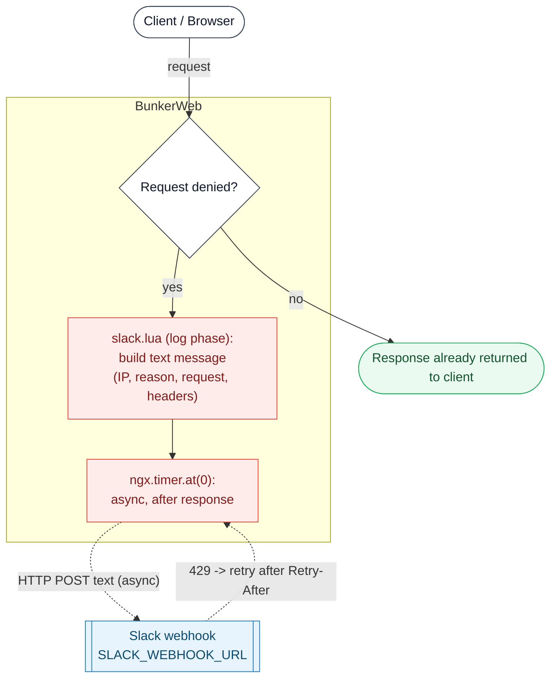

# Slack plugin




This [plugin](https://www.bunkerweb.io/latest/plugins/?utm_campaign=self&utm_source=github)
posts a Slack message to an incoming webhook every time BunkerWeb denies a
request. It is a notifier only: it never blocks, filters, or alters traffic
itself - it simply reports the denials made by BunkerWeb's own security
checks (rate limit, bad behavior, antibot, DNSBL, blacklist, ...).

The notification is built and sent from Lua during BunkerWeb's **log phase**,
after the response has already been returned to the client. The HTTP `POST`
to Slack runs inside an `ngx.timer.at(0)` timer, so it adds no latency to the
request. Each message carries the offending IP, the deny reason, the request
line, and the request headers - with sensitive headers redacted - inside a
Slack code block.

# Table of contents

- [Slack plugin](#slack-plugin)
- [Table of contents](#table-of-contents)
- [How it works](#how-it-works)
- [Prerequisites](#prerequisites)
- [Setup](#setup)
  - [Docker](#docker)
  - [Swarm](#swarm)
  - [Kubernetes](#kubernetes)
- [Settings](#settings)
- [Troubleshooting](#troubleshooting)
- [Notes](#notes)

# How it works

1. A client request is processed normally. BunkerWeb's security checks decide
   whether to allow or deny it; this plugin does not take part in that
   decision.
2. On the log phase, `slack.lua` runs. If `USE_SLACK` is not `yes`, or the
   request was **not** denied, it returns immediately and does nothing.
3. For a denied request it builds a plain-text message: a code block
   containing `Denied request for IP <ip>`, the deny reason and reason data,
   the request line (`ngx.var.request`), and every request header. Sensitive
   headers (`Authorization`, `Proxy-Authorization`, `Cookie`, `Set-Cookie`,
   `X-Api-Key`, `X-Csrf-Token`, `X-Auth-Token`, ...) are replaced with
   `[REDACTED]` before they leave BunkerWeb.
4. The message is handed to an `ngx.timer.at(0)` timer, so the `POST` to
   `SLACK_WEBHOOK_URL` happens asynchronously after the response is sent -
   request latency is unaffected.
5. If Slack replies `429` and `SLACK_RETRY_IF_LIMITED` is `yes`, the timer
   reschedules itself after the `Retry-After` delay; otherwise the message is
   dropped. Any other webhook error is logged only and never reaches the
   client.

Denials hitting the default server are also reported when
`DISABLE_DEFAULT_SERVER=yes` (handled by the `log_default` hook). A test
message can be sent on demand with a `POST` to `/slack/ping`.

# Prerequisites

Please read the [plugins section](https://docs.bunkerweb.io/latest/plugins/?utm_campaign=self&utm_source=github)
of the BunkerWeb documentation first.

You will need a Slack incoming webhook URL (of the form
`https://hooks.slack.com/services/...`). See Slack's
[webhooks documentation](https://api.slack.com/messaging/webhooks) for how to
create one. There is no additional service to run besides the plugin itself.

# Setup

See the [plugins section](https://docs.bunkerweb.io/latest/plugins/?utm_campaign=self&utm_source=github)
of the BunkerWeb documentation for the generic plugin installation procedure
(the short version: drop the `slack/` directory into the scheduler's
`/data/plugins/` and restart). Set the plugin environment variables on the
`bw-scheduler` service.

## Docker

```yaml
services:

  bw-scheduler:
    image: bunkerity/bunkerweb-scheduler:1.6.11
    ...
    environment:
      USE_SLACK: "yes"
      SLACK_WEBHOOK_URL: "https://hooks.slack.com/services/..."
    ...
```

## Swarm

```yaml
services:

  bw-scheduler:
    image: bunkerity/bunkerweb-scheduler:1.6.11
    ...
    environment:
      USE_SLACK: "yes"
      SLACK_WEBHOOK_URL: "https://hooks.slack.com/services/..."
    ...
```

## Kubernetes

```yaml
apiVersion: networking.k8s.io/v1
kind: Ingress
metadata:
  name: ingress
  annotations:
    bunkerweb.io/USE_SLACK: "yes"
    bunkerweb.io/SLACK_WEBHOOK_URL: "https://hooks.slack.com/services/..."
```

# Settings

| Setting                  | Default                                | Context   | Multiple | Description                                                                                  |
| ------------------------ | -------------------------------------- | --------- | -------- | -------------------------------------------------------------------------------------------- |
| `USE_SLACK`              | `no`                                   | multisite | no       | Enable sending alerts to a Slack channel.                                                    |
| `SLACK_WEBHOOK_URL`      | `https://hooks.slack.com/services/...` | global    | no       | Address of the Slack Webhook.                                                                |
| `SLACK_RETRY_IF_LIMITED` | `no`                                   | global    | no       | Retry to send the request if Slack API is rate limiting us (may consume a lot of resources). |

# Troubleshooting

- **No notifications arrive.** Confirm `USE_SLACK=yes` is set for the relevant
  site and that `SLACK_WEBHOOK_URL` is a valid incoming-webhook URL
  (`https://hooks.slack.com/services/...`). Trigger a test message with a
  `POST` to `/slack/ping` and check the response status.
- **`POST /slack/ping` returns 500.** The webhook request failed (Slack
  unreachable or a non-2xx reply). Verify the URL and that BunkerWeb has
  outbound network access to `hooks.slack.com`.
- **Webhook failures don't affect users - by design.** Send errors are logged
  only. Look in the BunkerWeb / scheduler logs for `error while sending
request` or `request returned status ...`; the client is never impacted.
- **Slack rate-limiting.** A log line `slack API is rate-limiting us` means
  Slack returned `429`. Set `SLACK_RETRY_IF_LIMITED=yes` to retry after the
  `Retry-After` delay (note the resource-usage warning in the settings).
- **Only denials are reported.** Allowed traffic never generates a message. If
  you expected a notification for a request that was ultimately allowed, that
  is expected behavior.

# Notes

- **Notifier only - never blocks traffic.** This plugin reports denials made by
  BunkerWeb's other security checks; it does not deny, filter, or modify any
  request itself.
- **Denied requests only.** A message is sent solely when a request is denied
  (and, with `DISABLE_DEFAULT_SERVER=yes`, for denials on the default server).
- **Zero added latency.** The webhook `POST` runs in an `ngx.timer.at(0)`
  timer on the log phase, after the response has been returned to the client.
- **Sensitive headers are redacted.** Credential-bearing headers
  (`Authorization`, `Cookie`, `Set-Cookie`, `X-Api-Key`, `X-Auth-Token`, ...)
  are replaced with `[REDACTED]` before the message leaves BunkerWeb.
- **Rate-limit retry trade-off.** `SLACK_RETRY_IF_LIMITED=yes` keeps
  rescheduling timers under sustained `429` responses, which can consume
  resources during a flood of denials. Leave it `no` if you would rather drop
  notifications than queue retries.
