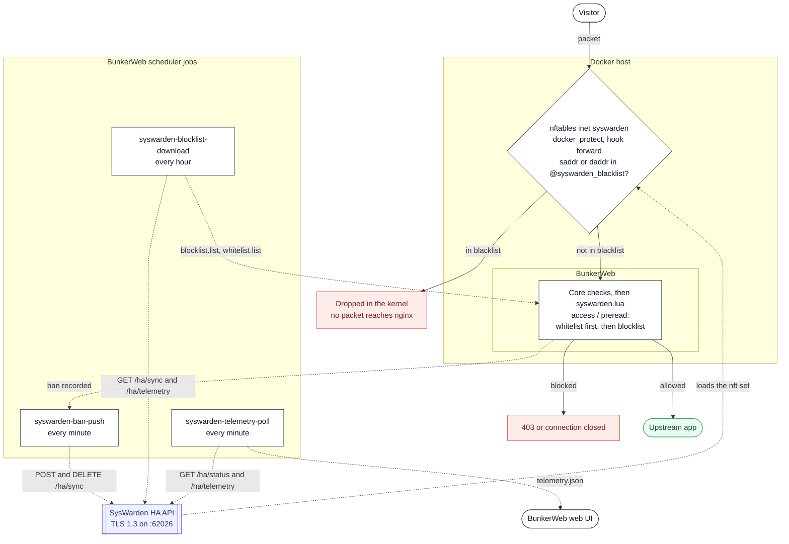

# SysWarden plugin




This [plugin](https://www.bunkerweb.io/latest/plugins/?utm_campaign=self&utm_source=github)
bridges BunkerWeb and [SysWarden](https://github.com/duggytuxy/syswarden), the host
security orchestrator that owns nftables (and PF) on your server. BunkerWeb sees the
whole request and decides who to ban; SysWarden drops packets in the kernel for the whole
host. The plugin makes each one act on what the other knows: a BunkerWeb ban becomes a
kernel drop within a minute, and SysWarden's blocklist becomes a Layer 7 deny.

Because SysWarden hooks `forward` (its `docker_protect` chain) and not only `input`, a
pushed ban also covers traffic destined to your containers — which is what makes this
useful for a Dockerised BunkerWeb.

The plugin talks to SysWarden's HA API over TLS and never writes to its files, so
SysWarden stays the only owner of its own state.

# Table of contents

- [SysWarden plugin](#syswarden-plugin)
- [Table of contents](#table-of-contents)
- [How it works](#how-it-works)
- [Prerequisites](#prerequisites)
  - [SysWarden side](#syswarden-side)
  - [TLS](#tls)
- [Setup](#setup)
  - [Docker](#docker)
  - [Linux](#linux)
- [Secrets](#secrets)
- [Settings](#settings)
- [Troubleshooting](#troubleshooting)
- [Notes](#notes)

# How it works

The plugin has two halves: scheduler jobs that talk to SysWarden, and per-request Lua
hooks in the BunkerWeb instance.

**Scheduler jobs (declared in `plugin.json`, scripts under `jobs/`):**

| Job                            | Schedule     | What it does                                                                                                                                                   |
| ------------------------------ | ------------ | -------------------------------------------------------------------------------------------------------------------------------------------------------------- |
| `syswarden-ban-push`           | every minute | Reads BunkerWeb's active bans (Redis when enabled, plus `GET /bans` on every instance), then reconciles each peer's blocklist with `POST` / `DELETE /ha/sync`. |
| `syswarden-blocklist-download` | hourly       | Downloads each peer's blocklist (`GET /ha/sync`) and whitelist (`GET /ha/telemetry`) into `blocklist.list` / `whitelist.list`, which the Lua side denies on.   |
| `syswarden-telemetry-poll`     | every minute | Polls `GET /ha/status` and `GET /ha/telemetry` per peer into `telemetry.json`, which feeds the web UI cards. Writes only when something changed.               |

**Per request (`syswarden.lua`), when `USE_SYSWARDEN_BLOCKLIST` or `USE_SYSWARDEN_WHITELIST` is on for the service:**

1. At `init`, the downloaded lists are read once and stored in the datastore; each worker
   builds its IP matcher from them.
2. In the `access` phase (and `preread` for stream services) the client address is checked
   against the **whitelist first**, then the blocklist. An address in both is allowed: the
   whitelist is the operator's explicit override, a blocklist hit is a policy default.
3. The verdict is cached per server for an hour, which is also the list's refresh period.

Both halves are independent: you can push bans without ever downloading a list, and the
other way round.

## Ownership: what the plugin will and will not delete

`/ha/sync` writes into SysWarden's **shared** manual blocklist, next to entries added by
an operator (`syswarden block`) and by real HA peers. The push job therefore keeps its own
registry of what it pushed (`pushed.json` in the job cache) and only ever deletes an entry
that is _in the registry_ and no longer banned in BunkerWeb. An entry it never pushed is
never touched, whatever else changes.

If a `DELETE` fails on one peer, the entry stays in the registry so the next pass retries
it, rather than orphaning it in that peer's blocklist.

# Prerequisites

Please read the [plugins section](https://docs.bunkerweb.io/latest/plugins) of the
BunkerWeb documentation first.

## SysWarden side

Enable the HA API on the SysWarden host and allow the BunkerWeb **scheduler** container's
IP (that is where the jobs run):

```toml
[integrations.ha]
enabled   = true
peer_ips  = ["<IP of bw-scheduler>"]
peer_port = 62026
token     = "<a long random token>"
```

> [!IMPORTANT]
> Set a token. SysWarden skips the bearer check entirely when its `token` is empty
> ("Legacy Mode"), which leaves the API authenticated by source IP alone. The plugin
> refuses to run without `SYSWARDEN_API_TOKEN` for the same reason.

> [!NOTE]
> `peer_ips` is matched as an exact string, so pin the scheduler to a fixed address in
> your compose file — a recreated container that picks a new IP gets 403s.

## TLS

SysWarden serves the HA API with a self-signed certificate generated per host
(`/var/lib/syswarden/ha/server.crt`). Pick one of three postures, in order of preference:

1. `SYSWARDEN_CA_BUNDLE` — mount a CA bundle that signs the peer's certificate.
2. `SYSWARDEN_SSL_FINGERPRINT` — pin the certificate's SHA-256 fingerprint, which is the
   practical option for a self-signed peer. Read it on the SysWarden host with:

   ```bash
   openssl x509 -in /var/lib/syswarden/ha/server.crt -noout -fingerprint -sha256
   ```

3. `SYSWARDEN_SSL_INSECURE=yes` — accept any certificate. The bearer token travels on that
   connection, so an active MITM captures it.

With none of the three set, the jobs **refuse to start** rather than downgrade silently.

# Setup

See the [plugins section](https://docs.bunkerweb.io/latest/plugins) of the BunkerWeb
documentation for the installation procedure depending on your integration (the short
version: drop the `syswarden/` directory into the scheduler's `/data/plugins/` and restart).

## Docker

Set the SysWarden settings on the **scheduler** service — that is where the plugin's jobs
run and where BunkerWeb reads its configuration.

```yaml
services:
  bunkerweb:
    image: bunkerity/bunkerweb:1.6.11
    ...
    networks:
      - bw-services

  bw-scheduler:
    image: bunkerity/bunkerweb-scheduler:1.6.11
    ...
    environment:
      SERVER_NAME: "app.example.com"
      USE_REVERSE_PROXY: "yes"
      REVERSE_PROXY_HOST: "http://app:3000"
      REVERSE_PROXY_URL: "/"

      USE_SYSWARDEN: "yes" # Mandatory
      SYSWARDEN_PEERS: "192.168.1.10" # host or host:port, default port 62026
      SYSWARDEN_API_TOKEN: "<the token from [integrations.ha]>"
      SYSWARDEN_SSL_FINGERPRINT: "AB:CD:...:EF" # openssl output is accepted as is

      # Push BunkerWeb bans down to nftables
      USE_SYSWARDEN_BAN_PUSH: "yes"
      SYSWARDEN_ENFORCEMENT: "audit" # start here, switch to "enforcing" once the logs look right

      # Deny SysWarden's blocklist at Layer 7 too (per service)
      USE_SYSWARDEN_BLOCKLIST: "yes"
      USE_SYSWARDEN_WHITELIST: "yes"

    networks:
      - bw-universe
      - bw-services
```

> [!TIP]
> Start with `SYSWARDEN_ENFORCEMENT: "audit"`. Every add and remove the job _would_ make is
> logged, and nothing is sent. Read one or two passes in the scheduler logs, then switch to
> `enforcing`.

## Linux

Same settings, in `/etc/bunkerweb/variables.env`, then `systemctl restart bunkerweb-scheduler`.

On a Linux integration BunkerWeb and SysWarden usually share the host, so `SYSWARDEN_PEERS`
is typically `127.0.0.1` and `peer_ips` contains `127.0.0.1`.

# Secrets

`SYSWARDEN_API_TOKEN` supports the Docker-secret `<NAME>_FILE` convention: set
`SYSWARDEN_API_TOKEN_FILE=/run/secrets/syswarden_api_token` and the jobs read the token
from that file instead of the environment.

# Settings

| Setting                           | Default     | Context   | Multiple | Description                                                                                                                                                                                              |
| --------------------------------- | ----------- | --------- | -------- | -------------------------------------------------------------------------------------------------------------------------------------------------------------------------------------------------------- |
| `USE_SYSWARDEN`                   | `no`        | global    | no       | Activate the SysWarden integration (ban push, blocklist download, telemetry).                                                                                                                            |
| `SYSWARDEN_PEERS`                 |             | global    | no       | SysWarden HA API endpoints, space-separated, as host or host:port (default port 62026). Bracket an IPv6 literal to give it a port: [2001:db8::1]:62026.                                                  |
| `SYSWARDEN_API_TOKEN`             |             | global    | no       | Bearer token of the SysWarden HA API ([integrations.ha] token). Required: a peer with an empty token authenticates on the peer IP alone. Supports the SYSWARDEN_API_TOKEN_FILE Docker-secret convention. |
| `SYSWARDEN_CA_BUNDLE`             |             | global    | no       | Path to a mounted CA bundle used to verify the peer's certificate, for example /etc/syswarden/ha-ca.pem.                                                                                                 |
| `SYSWARDEN_SSL_FINGERPRINT`       |             | global    | no       | SHA-256 fingerprint of the peer's certificate to pin, when no CA bundle is available (SysWarden self-signs per host).                                                                                    |
| `SYSWARDEN_SSL_INSECURE`          | `no`        | global    | no       | Talk to the peer without verifying its certificate. Explicit opt-out: without a CA bundle or a fingerprint, the jobs refuse to run instead of degrading silently.                                        |
| `SYSWARDEN_TIMEOUT`               | `10`        | global    | no       | Connect and read timeout in seconds for SysWarden HA API requests.                                                                                                                                       |
| `USE_SYSWARDEN_BAN_PUSH`          | `no`        | global    | no       | Push BunkerWeb's active bans to the SysWarden blocklist, so the attacker is dropped in the kernel for every service on the host, containers included.                                                    |
| `SYSWARDEN_ENFORCEMENT`           | `enforcing` | global    | no       | 'enforcing' pushes and removes bans; 'audit' logs every add and remove it would have made without sending anything. Start in audit.                                                                      |
| `SYSWARDEN_BAN_MAX_ITEMS`         | `10000`     | global    | no       | Maximum number of bans pushed per pass. Beyond it the set is truncated deterministically (sorted) and the count dropped is logged.                                                                       |
| `SYSWARDEN_BAN_CHUNK_SIZE`        | `500`       | global    | no       | Number of entries per POST/DELETE request to /ha/sync.                                                                                                                                                   |
| `SYSWARDEN_BAN_SCOPE_FILTER`      |             | global    | no       | Space-separated list of services whose bans are propagated. Empty means every service. Global bans are always propagated: they are not tied to a service.                                                |
| `SYSWARDEN_BAN_MIN_TTL`           | `0`         | global    | no       | Skip bans with less than N seconds left, so rate-limit noise does not churn the nftables set. Permanent bans are never skipped.                                                                          |
| `USE_SYSWARDEN_BLOCKLIST`         | `no`        | multisite | no       | Download SysWarden's blocklist and deny those IPs at Layer 7 as well. Useful when BunkerWeb and SysWarden do not run on the same host.                                                                   |
| `USE_SYSWARDEN_WHITELIST`         | `no`        | multisite | no       | Download SysWarden's whitelist and let it win over the blocklist, so an operator's explicit allow keeps working at Layer 7 too.                                                                          |
| `SYSWARDEN_BLOCKLIST_INTERVAL`    | `hour`      | global    | no       | How often the blocklist and whitelist are downloaded.                                                                                                                                                    |
| `SYSWARDEN_BLOCKLIST_EXCLUDE_OWN` | `yes`       | global    | no       | Subtract the IPs this plugin pushed from the downloaded blocklist: BunkerWeb already bans them at Layer 7, denying them twice adds nothing.                                                              |

# Troubleshooting

- **Every job exits 2 with "No usable TLS setting".** That is the gate doing its job: set
  `SYSWARDEN_CA_BUNDLE`, or `SYSWARDEN_SSL_FINGERPRINT`, or accept the risk with
  `SYSWARDEN_SSL_INSECURE=yes`.
- **The peer answers 403.** SysWarden compares `peer_ips` as an exact string. Check the
  source IP the scheduler container actually uses, and pin it in your compose file.
- **`syswarden-ban-push` finds 0 bans.** Without `USE_REDIS=yes` the bans are read from
  each instance's shared dict through `GET /bans`, which a BunkerWeb restart empties.
  That is expected: the ban was lost on the BunkerWeb side too, and the next pass removes
  it from SysWarden as well.
- **Nothing is ever pushed.** Check `SYSWARDEN_ENFORCEMENT` — in `audit` the job logs what
  it would do and sends nothing, which is exactly what the mode is for.
- **An operator entry disappeared from SysWarden's blocklist.** The plugin only deletes
  entries listed in its own `pushed.json` registry. If an entry was pushed by the plugin
  first and added by an operator afterwards, it is in the registry and will be removed once
  BunkerWeb stops banning it. Whitelist it on the SysWarden side instead.
- **`USE_SYSWARDEN_BLOCKLIST=yes` denies nobody.** The Lua side fails open until
  `blocklist.list` exists. Confirm `syswarden-blocklist-download` ran (the plugin's ping,
  `POST /syswarden/ping`, reports peer reachability from the cached telemetry).

# Notes

- **Fail-open by design.** The Layer 7 deny path never denies while the lists are empty or
  the IP matcher errors out. A dead peer or a job that has not run yet cannot lock everyone
  out of your sites.
- **The kernel drop is the fast path, not the only one.** A pushed ban reaches nftables
  within a minute (`syswarden-ban-push`); until then, and for anything SysWarden cannot see,
  BunkerWeb's own ban is what enforces the block.
- **Bans are flattened.** BunkerWeb bans can be scoped to one service; an nftables set is
  host-wide. Use `SYSWARDEN_BAN_SCOPE_FILTER` to choose which services' bans are allowed to
  become host-wide drops.
- **Stream support is partial.** In the stream (`preread`) context only the blocklist and
  whitelist check runs.
- **Free bonus, no code involved.** SysWarden's WAAP reads `/var/log/nginx/access.log` by
  default (`waap.bruteforce_logs`). Mounting BunkerWeb's `/var/log/nginx` onto the host
  gives it your full BunkerWeb traffic without this plugin being involved at all.
- **Tested against SysWarden v4.02.8.** The HA API is young; if a route or payload changes
  upstream, the jobs log the failure per peer and keep the cached lists.
