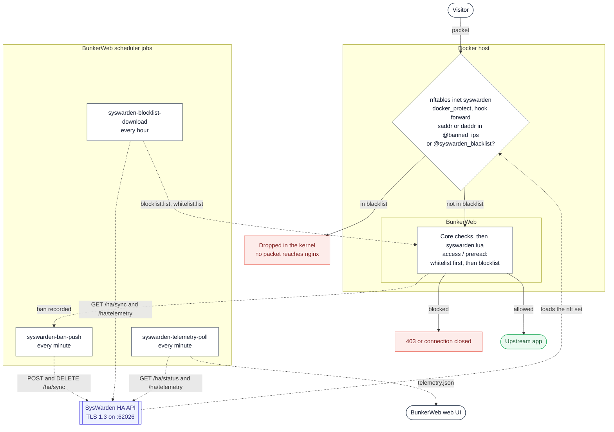

# SysWarden plugin




This [plugin](https://www.bunkerweb.io/latest/plugins/?utm_campaign=self&utm_source=github)
bridges BunkerWeb and [SysWarden](https://github.com/duggytuxy/syswarden), the host
security orchestrator that owns nftables on your server. BunkerWeb sees the
whole request and decides who to ban; SysWarden drops packets in the kernel for the whole
host. The plugin makes each one act on what the other knows: a BunkerWeb ban becomes a
kernel drop within a minute, and SysWarden's blocklist becomes a Layer 7 deny.

Because SysWarden hooks `forward` (its `docker_protect` chain) and not only `input`, a
pushed ban also covers traffic destined to your containers — which is what makes this
useful for a Dockerised BunkerWeb.

The plugin talks to SysWarden's HA API over TLS and never writes to its files, so
SysWarden stays the only owner of its own state.

# Table of contents

- [SysWarden plugin](#syswarden-plugin)
- [Table of contents](#table-of-contents)
- [How it works](#how-it-works)
  - [Ownership: what the plugin will and will not delete](#ownership-what-the-plugin-will-and-will-not-delete)
- [Known SysWarden defect: do not enable ban push on v4.03.2](#known-syswarden-defect-do-not-enable-ban-push-on-v4032)
- [Which bans reach SysWarden, and which stay local](#which-bans-reach-syswarden-and-which-stay-local)
- [Prerequisites](#prerequisites)
  - [SysWarden side](#syswarden-side)
  - [TLS](#tls)
- [Setup](#setup)
  - [Docker](#docker)
  - [Linux](#linux)
- [Secrets](#secrets)
- [Settings](#settings)
- [Troubleshooting](#troubleshooting)
- [Notes](#notes)

# How it works

The plugin has two halves: scheduler jobs that talk to SysWarden, and per-request Lua
hooks in the BunkerWeb instance.

**Scheduler jobs (declared in `plugin.json`, scripts under `jobs/`):**

| Job                            | Schedule     | What it does                                                                                                                                                   |
| ------------------------------ | ------------ | -------------------------------------------------------------------------------------------------------------------------------------------------------------- |
| `syswarden-ban-push`           | every minute | Reads BunkerWeb's active bans (Redis when enabled, plus `GET /bans` on every instance), then reconciles each peer's blocklist with `POST` / `DELETE /ha/sync`. |
| `syswarden-blocklist-download` | hourly       | Downloads each peer's blocklist (`GET /ha/sync`) and whitelist (`GET /ha/telemetry`) into `blocklist.list` / `whitelist.list`, which the Lua side denies on.   |
| `syswarden-telemetry-poll`     | every minute | Polls `GET /ha/status` and `GET /ha/telemetry` per peer into `telemetry.json`, which feeds the web UI cards. Writes only when something changed.               |

**Per request (`syswarden.lua`), when `USE_SYSWARDEN_BLOCKLIST` or `USE_SYSWARDEN_WHITELIST` is on for the service:**

1. At `init`, the downloaded lists are read once and stored in the datastore; each worker
   compiles them once at startup. Requests reuse those matchers instead of rebuilding them
   for every new address.
2. In the `access` phase (and `preread` for stream services) the client address is checked
   against the **whitelist first**, then the blocklist. An address in both is allowed: the
   whitelist is the operator's explicit override, a blocklist hit is a policy default.

Both halves are independent: you can push bans without ever downloading a list, and the
other way round.

## Known SysWarden defect: do not enable ban push on v4.03.2

> [!CAUTION]
> On SysWarden **v4.03.2** a banned address is not enforced as that single address, so bans can
> block considerably more traffic than intended — including traffic that has nothing to do with
> the banned host. This affects SysWarden's own bans as much as pushed ones, and it is a SysWarden
> defect rather than a plugin one.
>
> **Fixed in v4.03.3.** Upstream rejects the shape it used to write, and a run against a clean
> Ubuntu 26.04 host confirmed it: every element of `banned_ips` and `banned_ips6`, in both
> `inet syswarden` and `netdev syswarden_hw_drop`, is a single address — entries the plugin
> pushed and entries SysWarden banned itself alike. Upgrade rather than work around it.
>
> On v4.03.2, leave `USE_SYSWARDEN_BAN_PUSH` off, or run it with
> `SYSWARDEN_ENFORCEMENT: "audit"` so the plugin logs what it would push without sending anything.
> The pull direction (blocklist and whitelist download) and telemetry are unaffected and safe to
> use.
>
> To check a peer: `nft list set netdev syswarden_hw_drop banned_ips`. A healthy set lists single
> addresses; entries of the form `a.b.c.d-w.x.y.z` are this defect. Clearing that set is a
> temporary mitigation — it repopulates as soon as SysWarden bans anything again.

## Which bans reach SysWarden, and which stay local

From **v4.03.2** SysWarden validates every address in a `POST /ha/sync` before it mutates
anything, and refuses the whole request as soon as one of them is a protected target:

- anything carrying a prefix length — a ban target is one host, never a network;
- IPv4-mapped and zoned forms;
- anything that is not public unicast: loopback, link-local, multicast, RFC1918
  (`10/8`, `172.16/12`, `192.168/16`), CGNAT `100.64/10`, the documentation and benchmarking
  ranges, ULA `fc00::/7`, and the rest of the IANA special-purpose registry;
- per peer, its own interface addresses, anything inside its configured `peer_ips`, and
  anything on its whitelist.

The plugin evaluates the first half itself and simply does not send those bans, naming them
once per pass in the scheduler log. **This is expected, not a fault:** a BunkerWeb behind a
proxy or a load balancer bans RFC1918 addresses routinely, and those bans stay enforced at
Layer 7 by BunkerWeb — they just never become a kernel-level nftables drop, because SysWarden
will not put a private address in a public-facing DROP set.

The second half depends on state only the peer has, so a refusal can still come back. When it
does, the plugin bisects the batch to find the address, drops it, and lets the rest through;
it does not fail the pass over an address the peer will never accept. If you see
`refuses N address(es) as a firewall target` in the scheduler log, that is this path.

> [!NOTE]
> An address pushed **before** the peer was upgraded to v4.03.2 stays in its blocklist, since
> `DELETE` is not validated. The plugin removes those on its next pass, which is what upstream
> intends — unsafe historical entries stay detectable and removable, but cannot be reintroduced.

## Ownership: what the plugin will and will not delete

`/ha/sync` writes into SysWarden's **shared** blocklist, next to entries added by an
operator (`syswarden block`), by the WAAP, and by real HA peers. The push job never deletes
an entry it did not add itself, whatever else changes. How it knows depends on what the peer
supports: it asks every peer on every pass through the `capabilities` list of
`GET /ha/status`, so a cluster can be upgraded one host at a time.

Before the first mutation, the job reads the status and the blocklist of **every** configured
peer. An unreachable peer, a malformed response, or a ledger it cannot page through aborts
the whole pass without touching any of them: a partial view of the cluster is not
authoritative enough to decide a deletion anywhere.

**Peers that report `sync_ttl` and `sync_provenance`.** Each pushed ban carries its remaining
lifetime, the BunkerWeb ban reason, and the cluster-unique tag from `SYSWARDEN_BAN_SOURCE`.
SysWarden keys its ledger on `(address, source, peer scope)` and only deletes records
matching all three, so `GET /ha/sync?details=true` returns exactly the plugin's own entries
and the peer is the one holding the ownership. These bans also expire on their own, capped at
30 days for a permanent BunkerWeb ban, so a ban that simply runs out needs no call at all —
the plugin only deletes when BunkerWeb lifts one early.

**Peers that report neither.** They speak nothing but `{"ips": [...]}`, so the plugin keeps
its own durable registry of what it pushed (`pushed.json` in the job cache) and only deletes
an entry that is _in the registry_ and no longer banned in BunkerWeb. Bans pushed this way are
permanent on the SysWarden side until the plugin removes them. Only a push that actually
succeeded enters the registry, so a failed push never grants ownership of an entry the plugin
did not write.

**Entries pushed before a peer was upgraded.** The two stores are disjoint upstream: entries
pushed in the legacy dialect live in the static blocklist, are reachable only through that
same dialect, and a provenance `DELETE` will never clear them. That store carries no
provenance at all, so removing from it automatically could destroy an operator or WAAP entry
— upstream confirmed this on 2026-08-18 and made the separate, explicit `DELETE {"ips"}` the
sanctioned cleanup. The plugin therefore keeps reconciling what it wrote before the upgrade,
in its own request carrying only `{"ips"}`, since mixing the two forms in one body is refused.

**Peers that replicate to each other.** SysWarden peers sync their static blocklist to each
other on their own cron, and that run can also be started by hand or already be in flight, so
an entry the plugin deletes on one peer can be written back by another. Cleanup is explicit
and peer by peer; SysWarden never propagates a `DELETE {"ips"}` for you.

**When a claim is released.** The plugin drops a claim only after the address has been absent
from every peer for an hour **and** BunkerWeb no longer bans it. That window restarts, rather
than pauses, when:

- a peer reports the address again, which is also logged;
- a pass could not see the whole cluster, because an hour of continuous absence must never
  span a period during which the view was partial;
- `SYSWARDEN_PEERS` changes, since the perimeter the window was measured against is no longer
  the same.

An address BunkerWeb still bans is never cleaned up in the legacy dialect at all:
`GET /ha/sync` returns the union of both stores and so cannot prove on its own that the static
entry is gone. `SYSWARDEN_BAN_MAX_ITEMS` limits only the missing **additions** sent to a peer
per pass, so a large backlog drains over later passes and a delayed entry is never turned into
a removal. If an addition fails on a peer, that pass sends no removals to the same peer.

**Closing the migration takes more than a window**, and the work splits three ways. The
operator supplies the exhaustive, frozen inventory of every node able to hold or republish an
entry. SysWarden supplies a verifiable local fence covering its cron, its manual runs and
syncs already sent with an older snapshot, shipped as a gate of its v4.03.2. The plugin keeps
the durable registry, cleans up on each peer, and holds its claim until the cluster-wide
condition is met.

**Producing and mounting the fence manifest.** On a SysWarden node:

```bash
syswarden ha-fence manifest create \
  --inventory <inventory.json> --output <manifest.json> --assert-complete
```

Distribute that same file, byte for byte, to every SysWarden node and to BunkerWeb, then point
`SYSWARDEN_FENCE_MANIFEST` at the mounted copy. The command writes a root-owned `0600` file,
so the copy handed to the scheduler has to be readable by the container's user; mount it
read-only. A manifest that is configured but unreadable, malformed, or built without
`--assert-complete` stops the job instead of falling back to the looser posture: a perimeter
nobody vouched for cannot support a proof.

**What the manifest governs.** The **push** job only, since it is the only one that mutates a
peer. There, `members` becomes the perimeter and `SYSWARDEN_PEERS` is not read, each peer is
pinned to the **exact** leaf certificate the manifest records (a re-issue under the same CA no
longer passes), and `epoch` drives the release window, so a new manifest restarts every
claim's clock. The blocklist download and the telemetry poll keep reading `SYSWARDEN_PEERS`
with the CA bundle or fingerprint posture: they only read, and a manifest is about who may be
written to.

**What the plugin proves, on every pass.** It mints a fresh 32-byte challenge per peer and
sends it on an authenticated `GET /ha/status`. The fence is accepted only when the six
conditions hold together:

- the body comes from an authenticated, uncached `GET /ha/status`;
- the challenge comes back echoed;
- `epoch`, `membership_sha256` and `legacy_writer_inventory_sha256` equal the manifest's;
- the state is exactly `active_drained`;
- `active_outbound_writers` and `active_inbound_legacy_mutations` are both zero;
- `generation`, `server_instance_id` and `condition` are unchanged.

Values are compared as strings; the plugin never recomputes SysWarden's digests. A single
missing proof is a broken fence, not an ambiguity, and that peer is left alone for the pass.

**What a proven fence changes.**

- Legacy `{"ips"}` additions are held rather than sent, since upstream answers them `423` by
  design while the fence is engaged.
- Every cleanup `DELETE {"ips"}` carries the token in `X-SysWarden-HA-Fence-Condition`, and a
  `412` is read as "the fence moved, nothing was written" rather than as a transport error.
  The header is sent only when a live proof exists, because upstream also answers `412` to a
  condition presented while the fence is inactive.
- After mutating, every fence is read again: if the identity triple moved during the pass, the
  deletions may have landed across a boundary, so every claim is held.
- An address the plugin had removed reappearing while **every** peer proves a drained fence is
  no longer attributable to HA replication, so the pass stops and leaves the decision to the
  operator instead of deleting it again.
- Releasing a claim gets stricter: the hour above stays necessary but is no longer sufficient.
  The claim is dropped only when every member proved a drained fence on the same pass, and a
  manifest whose campaign is not engaged holds every claim instead of ageing them out. A fence
  that moved between the decision and the end of the pass holds them too.

**No finite window is a proof.** Without a manifest, or against peers that do not carry the
fence, an hour of absence is convergence and nothing more. If the inventory is incomplete, if
a peer is unavailable, or if a fence is unverified, the migration stays open and the registry
is not released. A peer leaves the perimeter only on an operator decision attesting it is
isolated, decommissioned, and unable to republish.

# Prerequisites

Please read the [plugins section](https://docs.bunkerweb.io/latest/plugins) of the
BunkerWeb documentation first.

## SysWarden side

SysWarden documents its own side of this integration in
[its wiki](https://github.com/duggytuxy/syswarden/wiki/BunkerWeb-Integration); read it
alongside this page, since it is the authority on what the peer accepts.

> [!IMPORTANT]
> The settings below belong in a module file under `/etc/syswarden/config/modules/`, **not** in
> `/etc/syswarden/config/config.toml`. Prefer `99-user.toml`: it merges last and overrides every
> other module, while `syswarden install` owns `40-integrations.toml` and rewrites it with a full
> set of explicit defaults (`enabled = false`, `peer_ips = []`, `token = ''`). Modules are
> merged _after_ `config.toml` — so anything you put in `config.toml` is silently overridden and
> the HA API never starts, with nothing logged to say why. Check what actually took effect with
> `syswarden config-get integrations.ha.enabled`.

> [!NOTE]
> This plugin is developed and tested against SysWarden **v4.03.3**, the release the HA API
> contract here was verified against — every contract point in this page was re-checked against
> a live v4.03.3 daemon. Note that v4.03.0 and v4.03.1 were never published, v4.03.2 was the
> first public release of that line, and the line is amd64 only (ARM64 and aarch64 packages
> were retired). Older peers are still supported: the plugin negotiates the dialect
> per peer from the capabilities each one advertises.

Enable the HA API on the SysWarden host and allow the BunkerWeb **scheduler** container's
IP (that is where the jobs run):

```toml
[integrations.ha]
enabled   = true
peer_ips  = ["<IP of bw-scheduler>"]
peer_port = 62026
token     = "<a long random token>"

[integrations.bunkerweb]
enabled = true
```

> [!IMPORTANT]
> Set a token. On v4.03.3 an empty one is refused at configuration validation, naming this
> integration: `integrations.bunkerweb.enabled requires a non-empty integrations.ha.token`.
> The reload fails and the previous configuration stays live, so it fails closed. Older
> versions start anyway and skip the bearer check entirely ("Legacy Mode"), leaving the API
> authenticated by source IP alone. The plugin refuses to run without `SYSWARDEN_API_TOKEN`
> for the same reason.

> [!NOTE] > `[integrations.bunkerweb]` unlocks expiring bans and provenance: with it off, SysWarden
> advertises neither `sync_ttl` nor `sync_provenance`. That is decided **per peer**, not
> globally — a peer missing either capability is spoken to in the older `{"ips"}` dialect
> instead, so a mixed cluster still synchronizes. What it costs on that peer is the ban
> lifetime and the provenance tag: its entries are permanent until the plugin deletes them.
> Blocklist download and telemetry stay available independently.

> [!NOTE]
> Prefer a CIDR in `peer_ips` on recent SysWarden versions. It survives a recreated scheduler
> container picking a new address, and it also changes the daemon's posture: an exact address is
> an outbound destination SysWarden dials every 30 minutes, a CIDR authorizes inbound peers and
> is never dialed. With only CIDRs configured it reports
> `HA Cluster ENABLED in inbound-only mode`, which is what you want — the scheduler is a client
> of this API, not an HA node.
> Older versions match the address as an exact string, so there, pin the scheduler to a fixed
> address in your compose file or a recreated container gets 403s.

## TLS

SysWarden serves the HA API with a self-signed certificate generated per host
(`/var/lib/syswarden/ha/server.crt`). Pick one of three postures, in order of preference:

1. `SYSWARDEN_CA_BUNDLE` — mount a CA bundle that signs the peer's certificate.
2. `SYSWARDEN_SSL_FINGERPRINT` — pin the certificate's SHA-256 fingerprint, which is the
   practical option for one self-signed certificate identity. One configured fingerprint
   applies to every peer; use a CA bundle when peers have distinct certificates. Read the
   fingerprint on the SysWarden host with:

   ```bash
   openssl x509 -in /var/lib/syswarden/ha/server.crt -noout -fingerprint -sha256
   ```

3. `SYSWARDEN_SSL_INSECURE=yes` — accept any certificate. The bearer token travels on that
   connection, so an active MITM captures it.

With none of the three set, the jobs **refuse to start** rather than downgrade silently.

# Setup

See the [plugins section](https://docs.bunkerweb.io/latest/plugins) of the BunkerWeb
documentation for the installation procedure depending on your integration (the short
version: drop the `syswarden/` directory into the scheduler's `/data/plugins/` and restart).

## Docker

Set the SysWarden settings on the **scheduler** service — that is where the plugin's jobs
run and where BunkerWeb reads its configuration.

```yaml
services:
  bunkerweb:
    image: bunkerity/bunkerweb:1.6.11
    ...
    networks:
      - bw-services

  bw-scheduler:
    image: bunkerity/bunkerweb-scheduler:1.6.11
    ...
    environment:
      SERVER_NAME: "app.example.com"
      USE_REVERSE_PROXY: "yes"
      REVERSE_PROXY_HOST: "http://app:3000"
      REVERSE_PROXY_URL: "/"

      USE_SYSWARDEN: "yes" # Mandatory
      # host or host:port (default 62026); bracket an IPv6 literal: [2001:db8::1]:62026
      SYSWARDEN_PEERS: "192.168.1.10"
      SYSWARDEN_API_TOKEN: "<the token from [integrations.ha]>"
      SYSWARDEN_SSL_FINGERPRINT: "AB:CD:...:EF" # openssl output is accepted as is

      # Push BunkerWeb bans down to nftables
      USE_SYSWARDEN_BAN_PUSH: "yes"
      SYSWARDEN_BAN_SOURCE: "production-cluster-a" # unique for this BunkerWeb cluster
      SYSWARDEN_ENFORCEMENT: "audit" # start here, switch to "enforcing" once the logs look right

      # Deny SysWarden's blocklist at Layer 7 too (per service)
      USE_SYSWARDEN_BLOCKLIST: "yes"
      USE_SYSWARDEN_WHITELIST: "yes"

    networks:
      - bw-universe
      - bw-services
```

> [!TIP]
> Start with `SYSWARDEN_ENFORCEMENT: "audit"`. Every add and remove the job _would_ make is
> logged, and nothing is sent. Read one or two passes in the scheduler logs, then switch to
> `enforcing`.

## Linux

Same settings, in `/etc/bunkerweb/variables.env`, then `systemctl restart bunkerweb-scheduler`.

On a Linux integration BunkerWeb and SysWarden usually share the host, so `SYSWARDEN_PEERS`
is typically `127.0.0.1`.

> [!WARNING]
> Do **not** put `127.0.0.1` in SysWarden's `peer_ips`. The installer auto-whitelists every
> peer address, and loopback is in the special-use table its firewall validation refuses, so
> `syswarden install` aborts with
> `failed to auto-whitelist HA peer 127.0.0.1/32: exit status 1` and leaves the package
> unconfigured. That abort was observed on v4.03.2; on v4.03.3 the rejection is still there —
> `syswarden whitelist 127.0.0.1` answers
> `firewall list entry "127.0.0.1" is non-routable or special-use`. Use the host's own LAN or
> public address instead.

# Secrets

`SYSWARDEN_API_TOKEN` supports the Docker-secret `<NAME>_FILE` convention: set
`SYSWARDEN_API_TOKEN_FILE=/run/secrets/syswarden_api_token` and the jobs read the token
from that file instead of the environment.

# Settings

| Setting                           | Default     | Context   | Multiple | Description                                                                                                                               |
| --------------------------------- | ----------- | --------- | -------- | ----------------------------------------------------------------------------------------------------------------------------------------- |
| `USE_SYSWARDEN`                   | `no`        | global    | no       | Activate the SysWarden integration (ban push, blocklist download, telemetry).                                                             |
| `SYSWARDEN_PEERS`                 |             | global    | no       | SysWarden HA API endpoints, space-separated, as host or host:port (default port 62026).                                                   |
| `SYSWARDEN_API_TOKEN`             |             | global    | no       | Bearer token of the SysWarden HA API ([integrations.ha] token). Required. Supports the SYSWARDEN_API_TOKEN_FILE Docker-secret convention. |
| `SYSWARDEN_CA_BUNDLE`             |             | global    | no       | Path to a mounted CA bundle that verifies the peer's certificate, e.g. /etc/syswarden/ha-ca.pem.                                          |
| `SYSWARDEN_SSL_FINGERPRINT`       |             | global    | no       | SHA-256 fingerprint pinning the peer's certificate, when no CA bundle is available. One pin applies to every peer.                        |
| `SYSWARDEN_SSL_INSECURE`          | `no`        | global    | no       | Talk to the peer without verifying its certificate. Without it, a CA bundle or a fingerprint is required.                                 |
| `SYSWARDEN_FENCE_MANIFEST`        |             | global    | no       | Path to a mounted HA fence manifest. Ban push only: its members replace SYSWARDEN_PEERS and are pinned to the certificates it records.    |
| `SYSWARDEN_TIMEOUT`               | `5`         | global    | no       | Connect and read timeout in seconds for SysWarden HA API requests (1-30).                                                                 |
| `USE_SYSWARDEN_BAN_PUSH`          | `no`        | global    | no       | Push BunkerWeb's active bans to SysWarden, so the attacker is dropped in the kernel for every service on the host, containers included.   |
| `SYSWARDEN_ENFORCEMENT`           | `enforcing` | global    | no       | 'enforcing' pushes and removes bans; 'audit' only logs what it would send. Start in audit.                                                |
| `SYSWARDEN_BAN_MAX_ITEMS`         | `10000`     | global    | no       | Maximum bans added to each peer per pass, 0 meaning no limit. A larger backlog drains over later passes.                                  |
| `SYSWARDEN_BAN_CHUNK_SIZE`        | `500`       | global    | no       | Entries per POST/DELETE to /ha/sync. Lowered automatically to whichever ceiling the peer enforces.                                        |
| `SYSWARDEN_BAN_SCOPE_FILTER`      |             | global    | no       | Space-separated services whose bans are propagated. Empty means every service; global bans always are.                                    |
| `SYSWARDEN_BAN_MIN_TTL`           | `0`         | global    | no       | Skip bans with less than N seconds left, so rate-limit noise does not churn the nftables set.                                             |
| `SYSWARDEN_BAN_SOURCE`            |             | global    | no       | Cluster-unique provenance tag written on every pushed ban. Required with ban push; two clusters must never share one.                     |
| `USE_SYSWARDEN_BLOCKLIST`         | `no`        | multisite | no       | Download SysWarden's blocklist and deny those IPs at Layer 7 too, for when the two run on different hosts.                                |
| `USE_SYSWARDEN_WHITELIST`         | `no`        | multisite | no       | Download SysWarden's whitelist and let it win over the blocklist at Layer 7.                                                              |
| `SYSWARDEN_BLOCKLIST_INTERVAL`    | `hour`      | global    | no       | How often the blocklist and whitelist are downloaded.                                                                                     |
| `SYSWARDEN_BLOCKLIST_EXCLUDE_OWN` | `yes`       | global    | no       | Subtract the IPs this plugin pushed from the downloaded blocklist: BunkerWeb already bans them at Layer 7.                                |

# Troubleshooting

- **A job exits 2 with "No usable TLS setting".** That is the gate doing its job: set
  `SYSWARDEN_CA_BUNDLE`, or `SYSWARDEN_SSL_FINGERPRINT`, or accept the risk with
  `SYSWARDEN_SSL_INSECURE=yes`.
- **The peer answers 403.** Either the scheduler's source IP is outside `peer_ips` — check
  the address the container actually uses, and pin it in your compose file — or
  the bearer token does not match. `[integrations.bunkerweb] enabled = false` instead
  removes the capabilities ban push requires, so the preflight refuses to mutate.
- **`syswarden-ban-push` finds 0 bans.** Without `USE_REDIS=yes` the bans are read from
  each instance's shared dict through `GET /bans`, which a BunkerWeb restart empties.
  That is expected: the ban was lost on the BunkerWeb side too, and the next pass removes
  it from SysWarden as well.
- **Nothing is ever pushed.** Set a valid, cluster-unique `SYSWARDEN_BAN_SOURCE`, confirm
  every peer advertises `sync_ttl` and `sync_provenance`, and check
  `SYSWARDEN_ENFORCEMENT`. In `audit`, the job logs what it would do and sends nothing.
- **An operator entry disappeared from SysWarden's blocklist.** Against a peer that tracks
  provenance this plugin cannot cause that: it never sends a provenance-free mutation,
  and deletes carry the explicit BunkerWeb cluster source. Inspect other producers and
  SysWarden's own logs.
- **`USE_SYSWARDEN_BLOCKLIST=yes` denies nobody.** The Lua side fails open until
  `blocklist.list` exists. Confirm `syswarden-blocklist-download` ran, and read the peer
  reachability card in the web UI — it comes from the telemetry the poll job stored in the
  database. The plugin's ping (`POST /syswarden/ping`) only reports that the plugin is live
  on that instance; it deliberately reads no telemetry, because the copy shipped to an
  instance is only refreshed when a job asks for a reload.

# Notes

- **Fail-open by design.** The Layer 7 deny path never denies while the lists are empty or
  the IP matcher errors out. A dead peer or a job that has not run yet cannot lock everyone
  out of your sites.
- **The kernel drop is the fast path, not the only one.** A pushed ban reaches nftables
  within a minute (`syswarden-ban-push`); until then, and for anything SysWarden cannot see,
  BunkerWeb's own ban is what enforces the block.
- **Bans are flattened.** BunkerWeb bans can be scoped to one service; an nftables set is
  host-wide. Use `SYSWARDEN_BAN_SCOPE_FILTER` to choose which services' bans are allowed to
  become host-wide drops.
- **A lifetime is sent once, not renewed.** On a peer that tracks provenance the lifetime
  goes out with the push and is never extended, so a BunkerWeb ban that is later made longer
  still expires on the peer at its original time. The next pass sees it gone and pushes it
  again, which costs at most a minute of kernel-level coverage.
- **Stream support is partial.** In the stream (`preread`) context only the blocklist and
  whitelist check runs.
- **Free bonus, no code involved.** SysWarden's WAAP discovers `/var/log/nginx/access.log`
  on its own when `waap.bruteforce_logs` is left at `auto`. Mounting BunkerWeb's
  `/var/log/nginx` onto the host gives it your full BunkerWeb traffic without this plugin
  being involved at all.
- **The batch size is capped by the peer, not by you.** `SYSWARDEN_BAN_CHUNK_SIZE` is lowered
  to whichever ceiling the peer enforces — 500 entries per request on a peer that tracks ban
  provenance, 1024 in the legacy `{"ips"}` dialect. A higher value is not an error, it is
  clamped.
- **Ban push is v4.03+ only.** The job reads every peer's advertised capabilities and
  complete provenance ledger before mutating any of them. Older peers can still serve
  blocklists and telemetry, but one in `SYSWARDEN_PEERS` blocks ban push for the whole pass.
