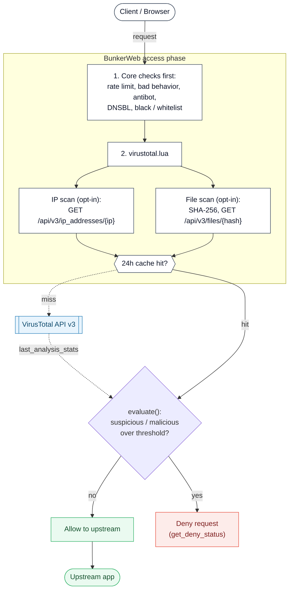

# VirusTotal plugin




This [BunkerWeb](https://www.bunkerweb.io/?utm_campaign=self&utm_source=github)
plugin checks incoming requests against the
[VirusTotal](https://www.virustotal.com/) API v3 during BunkerWeb's access
phase. When enabled, it can look up the client's IP address and the SHA-256 of
each file uploaded in a `multipart/form-data` request, then deny the request
when VirusTotal's aggregated verdict crosses a configurable threshold.

The check runs from Lua in the access phase, so all of BunkerWeb's built-in
checks (rate limit, bad behavior, antibot, DNSBL, whitelist / blacklist, ...)
run _before_ VirusTotal is queried — already-blocked clients never consume an
API call. IP and file lookups are cached for 24 hours (IP keyed by address,
file keyed by SHA-256), so repeated visitors and identical uploads do not
re-query the API.

# Table of contents

- [VirusTotal plugin](#virustotal-plugin)
- [Table of contents](#table-of-contents)
- [How it works](#how-it-works)
- [Prerequisites](#prerequisites)
- [Setup](#setup)
  - [Docker](#docker)
  - [Swarm](#swarm)
  - [Kubernetes](#kubernetes)
- [Settings](#settings)
- [Troubleshooting](#troubleshooting)
- [Limitations](#limitations)

# How it works

For a request to `https://app.example.com/...`:

1. BunkerWeb's access-phase checks run first (rate limit, bad behavior,
   antibot, DNSBL, blacklist, ...). If any of them deny, the request stops
   before VirusTotal is contacted.
2. `virustotal.lua` runs when `USE_VIRUSTOTAL=yes` and at least one of
   `VIRUSTOTAL_SCAN_IP` / `VIRUSTOTAL_SCAN_FILE` is `yes`. There is **no**
   `init_worker` pre-connect — VirusTotal has no usable health endpoint — so
   API connectivity problems first surface on a real request rather than at
   worker startup.
3. **IP scan** (when `VIRUSTOTAL_SCAN_IP=yes` _and_ the client IP is global):
   the handler does a `GET` against `/ip_addresses/<ip>`. Private, loopback and
   other non-global addresses are skipped.
4. **File scan** (when `VIRUSTOTAL_SCAN_FILE=yes` _and_ the request is
   `multipart/form-data`): each part that carries a filename is hashed with
   SHA-256, then looked up with a `GET` against `/files/<sha256>`. Parts without
   a filename (plain form fields) are ignored. Over **HTTP/1.x** the body is
   streamed with `resty.upload`; over **HTTP/2 / HTTP/3** - where the raw request
   socket `resty.upload` relies on is unavailable - the body is buffered (in
   memory, or nginx's temp file for large uploads) and its multipart parts are
   parsed before hashing. The IP scan never reads the body and works on every
   protocol.
5. Both paths first consult the 24-hour cache (IP keyed by address, file keyed
   by SHA-256). On a cache miss the VirusTotal API is queried and the result is
   stored for 24 hours.
6. **Verdict** (`virustotal_helpers.evaluate`): VirusTotal's
   `last_analysis_stats` _suspicious_ and _malicious_ counts are compared to
   their thresholds using a strict `>` — a count exactly equal to its
   threshold is still treated as clean. A `404` (the hash or IP is unknown to
   VirusTotal) is treated as clean. If either count exceeds its threshold the
   request is denied with BunkerWeb's deny status; otherwise it continues to
   the upstream.

On any other API error (a non-`200`, non-`404` response — for example a `401`
from a missing key or a `429` rate limit), the handler returns the error, which
surfaces as a BunkerWeb HTTP 500 rather than silently allowing the request.

The plugin also exposes an internal `POST /virustotal/ping` API endpoint, used
by the BunkerWeb web UI to confirm connectivity: it looks up the EICAR test
file's SHA-256 on VirusTotal and reports success only if that known hash is
returned.

# Prerequisites

Please read the [plugins section](https://docs.bunkerweb.io/latest/plugins/?utm_campaign=self&utm_source=github)
of the BunkerWeb documentation first.

You will need a VirusTotal API key to contact their API (see
[here](https://support.virustotal.com/hc/en-us/articles/115002088769-Please-give-me-an-API-key)).
The free (public) API key works too, but it is rate-limited (roughly 4 requests
per minute) — review the terms of service and limits described
[here](https://support.virustotal.com/hc/en-us/articles/115002119845-What-is-the-difference-between-the-public-API-and-the-private-API-)
before relying on it for high-traffic scanning.

# Setup

See the [plugins section](https://docs.bunkerweb.io/latest/plugins/?utm_campaign=self&utm_source=github)
of the BunkerWeb documentation for the generic installation procedure
depending on your integration. The plugin settings go on the **scheduler**
service.

## Docker

```yaml
services:

  bw-scheduler:
    image: bunkerity/bunkerweb-scheduler:1.6.11
    ...
    environment:
      USE_VIRUSTOTAL: "yes"
      VIRUSTOTAL_API_KEY: "mykey"
    ...
```

## Swarm

```yaml
services:

  bw-scheduler:
    image: bunkerity/bunkerweb-scheduler:1.6.11
    ...
    environment:
      USE_VIRUSTOTAL: "yes"
      VIRUSTOTAL_API_KEY: "mykey"
    ...
    networks:
      - bw-plugins
    ...
```

## Kubernetes

```yaml
apiVersion: networking.k8s.io/v1
kind: Ingress
metadata:
  name: ingress
  annotations:
    bunkerweb.io/USE_VIRUSTOTAL: "yes"
    bunkerweb.io/VIRUSTOTAL_API_KEY: "mykey"
```

# Settings

| Setting                      | Default                             | Context   | Multiple | Description                                                                      |
| ---------------------------- | ----------------------------------- | --------- | -------- | -------------------------------------------------------------------------------- |
| `USE_VIRUSTOTAL`             | `no`                                | multisite | no       | Activate VirusTotal integration.                                                 |
| `VIRUSTOTAL_API_KEY`         |                                     | global    | no       | Key to authenticate with VirusTotal API.                                         |
| `VIRUSTOTAL_API_URL`         | `https://www.virustotal.com/api/v3` | global    | no       | Base URL of the VirusTotal API (or a VirusTotal-compatible endpoint).            |
| `VIRUSTOTAL_TIMEOUT`         | `1000`                              | global    | no       | Timeout in milliseconds for VirusTotal API requests.                             |
| `VIRUSTOTAL_SCAN_FILE`       | `yes`                               | multisite | no       | Activate automatic scan of uploaded files with VirusTotal (only existing files). |
| `VIRUSTOTAL_SCAN_IP`         | `yes`                               | multisite | no       | Activate automatic scan of the client IP with VirusTotal.                        |
| `VIRUSTOTAL_IP_SUSPICIOUS`   | `5`                                 | global    | no       | Minimum number of suspicious reports before considering IP as bad.               |
| `VIRUSTOTAL_IP_MALICIOUS`    | `3`                                 | global    | no       | Minimum number of malicious reports before considering IP as bad.                |
| `VIRUSTOTAL_FILE_SUSPICIOUS` | `5`                                 | global    | no       | Minimum number of suspicious reports before considering file as bad.             |
| `VIRUSTOTAL_FILE_MALICIOUS`  | `3`                                 | global    | no       | Minimum number of malicious reports before considering file as bad.              |

# Troubleshooting

- **HTTP 500 on every scanned request, log says `received status 401 from VT
API`.** `VIRUSTOTAL_API_KEY` is missing or invalid. The key is required as
  soon as `USE_VIRUSTOTAL=yes` and a scan would fire; without a valid key the
  API call fails and the error surfaces as a 500 (the plugin never silently
  allows on error).
- **Intermittent HTTP 500 under load (`received status 429`).** You are hitting
  VirusTotal's rate limit. The public/free tier allows roughly 4 requests per
  minute, so high-traffic file scanning can exceed it. Use a private API key,
  cut down on what you scan, or rely on the 24-hour cache to absorb repeated
  lookups.
- **A known-bad file is not blocked.** Only files VirusTotal already knows (by
  hash) get a verdict. A hash VirusTotal has never seen returns `404`, which
  the plugin treats as clean — the plugin never uploads the file for analysis.
- **A file at exactly the threshold is allowed.** The threshold comparison is a
  strict `>`, so a count equal to `VIRUSTOTAL_FILE_SUSPICIOUS` /
  `VIRUSTOTAL_FILE_MALICIOUS` (or the IP equivalents) is still treated as clean.
  Lower the threshold by one to also block the equal case.
- **The client IP is never scanned.** Only global IP addresses are looked up;
  private, loopback and other non-global addresses are skipped. Behind another
  reverse proxy, make sure BunkerWeb's real-IP handling is configured so
  `remote_addr` is the actual client.
- **Requests time out / are slow.** Each cache miss makes a synchronous HTTP
  call to VirusTotal bounded by `VIRUSTOTAL_TIMEOUT` (default `1000` ms). Raise
  it if your path to the API is slow, but remember it adds latency to scanned
  requests.

# Limitations

- **File submission is not supported.** The plugin only _looks up_ existing
  file hashes on VirusTotal; it never uploads a file for analysis. A brand-new
  or otherwise unknown file returns `404` and is allowed through. Pair this
  with the ClamAV plugin if you need uploads to be scanned for unknown content.
- **IPs are scanned only when global.** Private, loopback and link-local client
  addresses are skipped by design.
- **HTTP/2 / HTTP/3 file scanning buffers the body.** On HTTP/1.x the upload is
  streamed via `resty.upload`; on HTTP/2 / HTTP/3 the request body is buffered
  (in memory, or nginx's client-body temp file once it exceeds
  `client_body_buffer_size`) and parsed before hashing, since `resty.upload`
  cannot read the raw request socket on those protocols. Buffered uploads are
  bounded by `MAX_CLIENT_SIZE`. If the request body genuinely cannot be read (a
  rare read error), the upload is allowed through without a file lookup (and
  logged); IP scanning is unaffected.
- **No startup health check.** Because VirusTotal exposes no usable ping
  endpoint, there is no `init_worker` pre-connect — an unreachable API or a bad
  key is only detected on the first request that triggers a lookup.
- **Verdict quality depends on VirusTotal's data.** Only files and IPs already
  present in VirusTotal's database yield a meaningful verdict, and the
  suspicious / malicious counts reflect third-party engines, so tune the
  thresholds to your tolerance for false positives.
