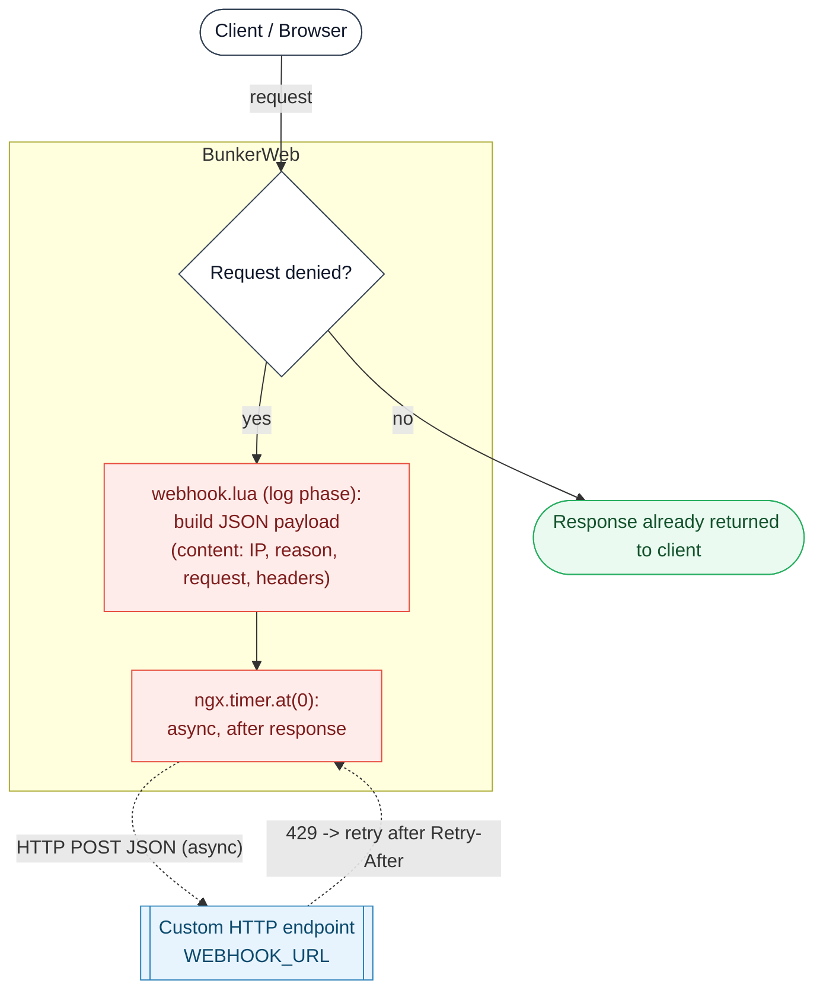

# WebHook plugin



This [BunkerWeb](https://www.bunkerweb.io/?utm_campaign=self&utm_source=github) plugin will automatically send you attack notifications on a custom HTTP endpoint of your choice using a webhook.

# Table of contents

- [WebHook plugin](#webhook-plugin)
- [Table of contents](#table-of-contents)
- [Prerequisites](#prerequisites)
- [Setup](#setup)
  - [Docker](#docker)
  - [Swarm](#swarm)
  - [Kubernetes](#kubernetes)
- [Settings](#settings)
- [TODO](#todo)

# Prerequisites

Please read the [plugins section](https://docs.bunkerweb.io/latest/plugins/?utm_campaign=self&utm_source=github) of the BunkerWeb documentation first.

# Setup

See the [plugins section](https://docs.bunkerweb.io/latest/plugins/?utm_campaign=self&utm_source=github) of the BunkerWeb documentation for the installation procedure depending on your integration.

There is no additional services to setup besides the plugin itself.

## Docker

```yaml
services:

  bw-scheduler:
    image: bunkerity/bunkerweb-scheduler:1.6.0-rc1
    ...
    environment:
      - USE_WEBHOOK=yes
      - WEBHOOK_URL=https://api.example.com/bw
    ...
```

## Swarm

```yaml
services:

  bw-scheduler:
    image: bunkerity/bunkerweb-scheduler:1.6.0-rc1
    ..
    environment:
      - USE_WEBHOOK=yes
      - WEBHOOK_URL=https://api.example.com/bw
    ...
```

## Kubernetes

```yaml
apiVersion: networking.k8s.io/v1
kind: Ingress
metadata:
  name: ingress
  annotations:
    bunkerweb.io/USE_WEBHOOK: "yes"
    bunkerweb.io/WEBHOOK_URL: "https://api.example.com/bw"
```

# Settings

| Setting                    | Default                      | Context   | Multiple | Description                                                                                          |
| -------------------------- | ---------------------------- | --------- | -------- | ---------------------------------------------------------------------------------------------------- |
| `USE_WEBHOOK`              | `no`                         | multisite | no       | Enable sending alerts to a custom webhook.                                                           |
| `WEBHOOK_URL`              | `https://api.example.com/bw` | global    | no       | Address of the webhook.                                                                              |
| `WEBHOOK_RETRY_IF_LIMITED` | `no`                         | global    | no       | Retry to send the request if the remote server is rate limiting us (may consume a lot of resources). |

# TODO

- Add more info in notification :
  - Date
  - Country of IP
  - ASN of IP
  - ...
- Add settings to control what details to send :
  - Anonymize IP
  - Add body
  - Add headers
